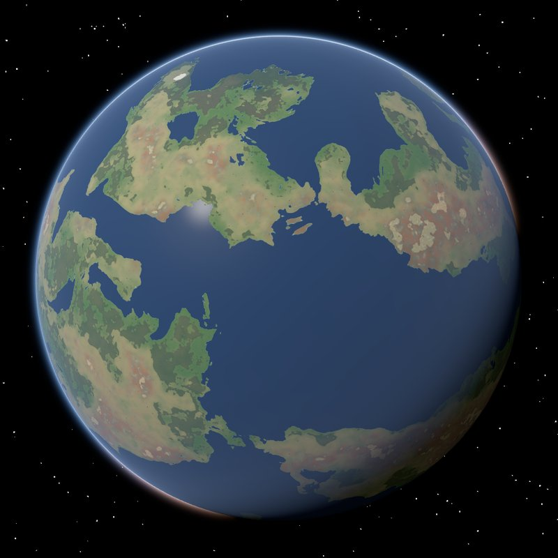
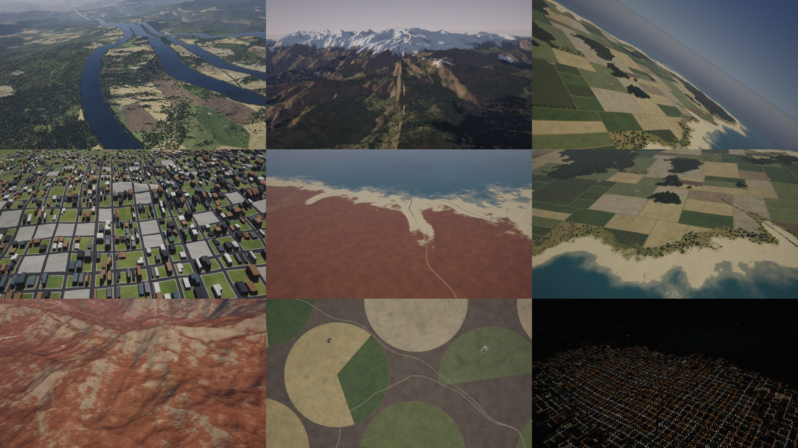
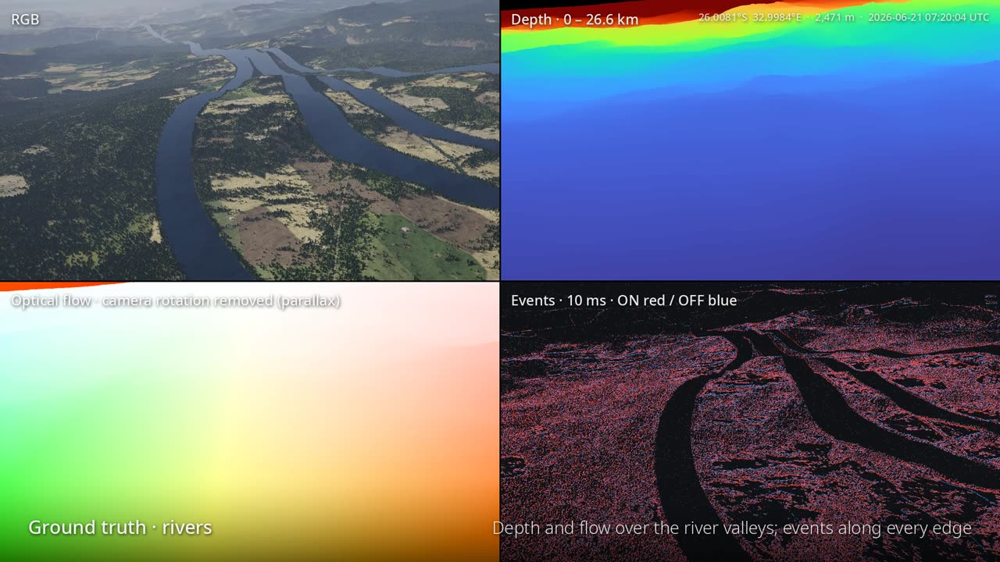

# aerialsynth

<p align="center"></p>

A procedural planet for aerial vision research. `terrain` generates a deterministic world as
Web-Mercator XYZ tiles, flies cameras and an IMU over it, and writes datasets with exact
ground truth. A viewer flies over the world in realtime. There is no imagery or elevation data
anywhere: every pixel comes from the generator, so any place on the planet, at any zoom, can be
produced on demand and reproduced exactly from a seed.





<sub>Top: stills from the [showcase video](showcase/README.md), rendered from generated tiles
only. Bottom: one frame of a dataset with its ground truth: RGB, depth, optical flow (parallax)
and events.</sub>

**Videos:** [the feature showcase](https://youtu.be/SkTq4ph64l4) (4:35) and
[a long-haul airliner flight](https://youtu.be/ByafGs-iNug) from the equator to the arctic
(3:49), also downloadable from the
[v0.1.0 release](https://github.com/shadymeowy/aerialsynth/releases/tag/v0.1.0).

- **World:** continents, mountains carved by erosion, rivers, lakes, climate and biomes,
  forests of individual trees, fields, towns with buildings, roads, night lights. Any place,
  any zoom, generated on demand (on the GPU, or the CPU) into one HDF5 tile store.
- **Flights:** spline paths with wind, gusts, turbulence and engine vibration; or your own
  trajectory CSV.
- **Sensors:**
  - cameras of any model (pinhole, fisheye, omnidirectional) with lighting for the date and
    time (sun, moon, stars, planets, night lights), atmosphere, shadows and a sensor model;
  - ground truth: depth, optical flow, land cover, star positions;
  - event cameras and an IMU.
- **Viewer:** a map of the tile store and the camera through the dataset renderer, flown
  live; and a dataset viewer and exporter (`terrain show`, `terrain export`).

## Install

Prebuilt, self-contained (HDF5 and zlib linked statically: nothing else to install) for Linux
(x86_64, aarch64; glibc ≥ 2.28), macOS (Apple silicon, Intel; macOS ≥ 11) and Windows (x86_64),
attached to each [GitHub release](https://github.com/shadymeowy/aerialsynth/releases):

- `terrain-<version>-<target>.tar.gz` / `.zip`: the `terrain` CLI (`bin/`) and the C library
  (`lib/`, `include/`; [`bindings/`](bindings/README.md#c));
- `aerialsynth-<version>-cp310-abi3-<platform>.whl`: the Python package, CPython ≥ 3.10
  ([`bindings/python`](bindings/python/README.md#install)).

## Requirements

To build from source (`cargo build`, `cargo install`; CI builds and tests Linux, macOS on Apple
silicon and Intel, and Windows):

- **Rust** 1.99 or newer (`rust-version` in `Cargo.toml`), via [rustup](https://rustup.rs).
- **A C compiler and CMake ≥ 3.26.** HDF5 (2.2.0) and zlib are built from source and linked
  statically (`hdf5-metno-sys`), so no system HDF5 is needed. The first build takes a few
  minutes.
  - Linux: gcc or clang (`build-essential`, `cmake`; on older distributions CMake from
    `pip install cmake`).
  - macOS: the Xcode Command Line Tools (`xcode-select --install`) and CMake (`brew install
    cmake`).
  - Windows: the Visual Studio Build Tools ("Desktop development with C++": MSVC and the
    Windows SDK; rustup's default `x86_64-pc-windows-msvc` toolchain) and CMake (bundled with
    the Build Tools, or from cmake.org). The C runtime is linked statically
    (`.cargo/config.toml`), so the binaries need no Visual C++ redistributable.
- **A GPU** with Vulkan, Metal or DX12 (through [wgpu](https://wgpu.rs)) for speed:
  - tile generation runs on the GPU when it supports 64-bit float and integer shaders
    (Vulkan on NVIDIA and recent AMD; not Metal, which has no 64-bit floats), else on the CPU.
    Both build the same world; the CPU is about 10× slower (`tiles.generator`, `docs/gpu.md`);
  - rendering runs on the GPU when there is one, else on the CPU reference renderer
    (`render.backend`);
  - the viewer (`terrain view`) needs a GPU.
- **Python 3** for the scripts (optional).

It is developed on Linux; macOS and Windows are built and tested in CI (macOS on Apple silicon
and Windows on the runners' virtual or software GPUs, macOS on Intel on the CPU only).

## Quick start

```sh
cargo build --release                       # the binary: target/release/terrain
cargo install --locked --path crates/cli --target-dir target   # optional: `terrain` on the PATH (reuses that build)
terrain view                                # the default world (seed 1, tiles in out/world.h5)
terrain config > my.yaml                    # a commented scenario template; edit it
terrain run -c my.yaml                      # trajectory → tiles → render (→ events)
terrain show out/quick/seq.h5               # look at a dataset (after `terrain run -c configs/quick.yaml`)
terrain view -c my.yaml                     # look around: map, camera (M), flying (F)
```

Without `-c` every command uses the default scenario. `--seed N` overrides `world.seed`: a
different planet. A tile store holds exactly one world: a store made with another seed or world
config is refused (the error names the settings that differ), so give each world its own
`tiles.file`.

`configs/quick.yaml` is a 3 s smoke test (16 frames of a 320 × 256 camera; under a minute on
4 CPU cores without a GPU, most of it generating its ~75 tiles, and ~6 s with one) and
`configs/dataset.yaml` a fuller dataset.
`configs/examples/` has night flights, a full moon, an event camera rig, a star tracker, a
fisheye, a 10 km cruise, a sunset and an IMU check.

## Commands

| command | |
|---|---|
| `terrain run` | make a dataset: trajectory → tiles → render → events. `--step traj,tiles,render,events` runs single steps (an existing trajectory file is kept unless `traj` is asked for); `--lazy` generates missing tiles while rendering |
| `terrain tiles` | plan and generate the flight's tiles; or a region's (`--bbox … --zooms 6-14`), a list's (`--list`); `--dry-run [-o FILE]` only lists them; `--png PREFIX --zoom Z` previews a mosaic without a store |
| `terrain view` | the viewer: map and camera, flown live; generates as you go (`docs/viewer.md`) |
| `terrain show SEQ.h5` | look at a dataset: every modality of a camera on a timeline (depth, flow, land cover, events, stars), the pose, IMU and trajectory, pixel values; `--snapshot` renders it without a window (`docs/show.md`) |
| `terrain export SEQ.h5 --out DIR\|FILE.mp4` | PNG sequences or videos (ffmpeg) of a camera's modalities, one per modality or `--side-by-side` with legends |
| `terrain survey` | find diverse places (coasts, mountains, towns, rivers, deserts, …) and render stills of each: `OUT/NN_<lat>_<lon>_<view>.png`, a labelled `OUT/sheet.jpg`, `OUT/places.csv`; `--count 24 --seed-places N`, `--views oblique,nadir,high`, `--places FILE.csv` re-renders a list (regression stills) |
| `terrain info FILE` | summarize a tile store or a sequence file |
| `terrain config` | the scenario template; `--all` every setting; `-c my.yaml` a scenario with its defaults filled in |

`run`, `tiles`, `view` and `config` read one scenario (`-c`) and take `--seed` (a different
world) and `-j` (threads); `show`, `export` and `info` take just the file.
`terrain <command> --help` lists the options.

## Outputs

- **Tile store** (`tiles.file`): the world's tiles, layers rgb, albedo, elevation (a surface model: ground, trees and buildings),
  normal, land cover, night lights. It holds one world and grows as needed.
- **Sequence file** (`output.file`):
  - body poses, the IMU, and every camera's frames, depth, flow, land cover, events and
    stars;
  - i64 µs timestamps, self-describing datasets (units, descriptions);
  - optional PNG / NPY export.

Both are plain HDF5; layouts in [`docs/formats.md`](docs/formats.md).

## Bindings

Tiles and rendering from C and Python ([`bindings/`](bindings/README.md)): open a world's tile
store and get a layer of tile z/x/y, or render a camera image (RGB, depth, land cover) from a
pose with the renderer of `terrain run`; tiles that are not stored yet are generated (GPU if
available, else CPU) and stored first. The world is given like `terrain -c FILE --seed N`.
The first render at a new place generates a few hundred tiles: under half a minute on a GPU,
minutes on a CPU (`World(..., verbose=True)` / `as_set_verbose` shows the progress, `World.prefetch` /
`as_prefetch` makes an area's tiles ahead; [details](bindings/README.md#rendering)).

```python
import aerialsynth                                       # bindings/python (maturin, abi3 ≥ 3.10)
w = aerialsynth.World("out/world.h5")                    # the default world; created if missing
rgb = w.tile(12, 2200, 1500, "rgb")                      # np.uint8 (256, 256, 3)
h = w.tile(12, 2200, 1500, "elevation")                  # np.float32 (256, 256), m above WGS84
cam = w.camera(width=640, height=480, hfov=90)           # or a scenario camera: config=, camera=
f = cam.render(45.0, 10.0, w.surface_height(45.0, 10.0) + 300, pitch=-30, yaw=90,
               time="2026-06-21T07:30:00Z", depth=True)  # f.rgb (480, 640, 3), f.depth (480, 640)
```

```c
as_world *w = as_open("out/world.h5", NULL, -1);        /* bindings/c: libaerialsynth */
static float h[256 * 256];                               /* 256 KiB: not on the stack */
as_tile(w, 12, 2200, 1500, AS_LAYER_ELEVATION, h, sizeof h);
as_close(w);
```

## Documentation

| | |
|---|---|
| [`docs/scenario.md`](docs/scenario.md) | writing scenarios: sections, cameras and modalities, conventions, look |
| [`docs/formats.md`](docs/formats.md) | the tile store and sequence file layouts, validation scripts |
| [`docs/simulation.md`](docs/simulation.md) | what is simulated: terrain, rendering, lighting, sensor, IMU, flights; performance, tests |
| [`docs/viewer.md`](docs/viewer.md) | the viewer: map and camera views, controls, snapshots and recordings |
| [`docs/show.md`](docs/show.md) | looking at a dataset: `terrain show` (viewer, snapshots) and `terrain export` (PNGs, videos) |
| [`docs/events.md`](docs/events.md) | event cameras |
| [`docs/stars.md`](docs/stars.md) | stars, planets, Moon: catalogue, astrometry, star ground truth |
| [`docs/gpu.md`](docs/gpu.md) | the GPU backend: tile generation and rendering |
| [`bindings/README.md`](bindings/README.md) | the C and Python bindings: tile access, rendering, building, examples |

## Repository layout

```
crates/geodesy    ellipsoid, geodetic/ECEF/ENU/NED/AER, XYZ tile math, attitude
crates/h5         safe wrapper over hdf5-sys (HDF5 2.2.0 bundled)
crates/tilestore  the HDF5 tile store
crates/terragen   the world generator (CPU / GPU)
crates/render     cameras, flights, level of detail, renderer (CPU / GPU), lighting, sensor, events, IMU, writers
crates/viewer     terrain view: map and camera views
crates/seqview    terrain show / export: the dataset viewer and exporter
crates/cli        the terrain command
bindings/         C API (libaerialsynth) and Python package (aerialsynth): tiles, rendering
configs/          example scenarios
docs/             documentation
scripts/          builders of the bundled star catalogue and ephemeris
showcase/         the showcase videos
```

`cargo test --release` runs the tests ([`docs/simulation.md`](docs/simulation.md#tests) lists
them).

## Data builders

```sh
pip install -r scripts/requirements.txt
```

`build_stars.py` and `build_planets.py` rebuild the bundled star catalogue and ephemeris.

[`showcase/`](showcase/README.md) renders the showcase video and the long-haul airliner flight,
fully from this repository; it has its own README and requirements. Its fonts (Noto Sans,
`showcase/fonts/`) are under the SIL Open Font License.

## License

Licensed under the Apache License, Version 2.0 ([LICENSE](LICENSE)).

Bundled data (`crates/render/data/`, built by the scripts above; see
[`docs/stars.md`](docs/stars.md#data-credits)):

- `stars_v9.bin`: derived from the Hipparcos (ESA 1997; new reduction, van Leeuwen 2007) and
  Tycho-2 (Høg et al. 2000) catalogues, ESA, obtained from CDS / VizieR (I/239, I/311, I/259).
- `planets.bin`: a subset of the JPL DE440 planetary ephemeris (Park et al. 2021), public
  domain.

The astrometry follows ERFA (BSD-3-Clause, derived from IAU SOFA); its nutation series is taken
from ERFA's `nut00b.c` (license text in [NOTICE](NOTICE)).
