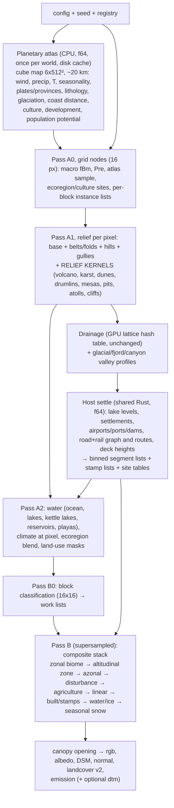

# terragen-next: a richer world generator (design)

Status: design proposal, nothing implemented. Branch `terrain-design`. It covers the
generator in `crates/terragen` (CPU: `world.rs`, `hydro.rs`, `surface.rs`, `tile.rs`; GPU:
`gpu/*.rs`, `gpu/wgsl/*.wgsl`) as of commit `a165067` (`GENERATOR_VERSION` 3).

## Summary

The current generator is well engineered. It is deterministic, band-limited by GSD, seamless,
LOD-consistent and fast on the GPU. Its *world model* is thin, though. Two continuous climate
scalars (temperature, moisture) drive one hand-written per-sample function, and that function
blends soil, grass, forest, sand, rock and snow with smoothsteps. Land use is one 7 km field-system lattice
with 4 styles. Settlements come from one 6 km town lattice with one street-grid generator. Roads are
iso-lines of noise. Each new feature has to be written three times: in `surface.rs`, in
`surface.wgsl`, and often again in `gpu/host.rs`. That cost is what holds variety down.

This design keeps every invariant and changes the world model in five ways:

1. **A planetary atlas.** A small, deterministic, disk-cached cube map (6×512², ~20 km texels)
   holds the quantities that cannot be computed locally: wind, moisture advected with
   **rain shadows**, seasonality, **tectonic provinces and lithology**, past glaciation,
   distance to the coast, **cultures** and population potential. It is computed once per world on
   the CPU in f64, and both backends sample the same buffer.
2. **Discrete ecoregions and cultures.** A warped Voronoi lattice of ecoregions (~100 km)
   and of culture areas (~1000 km) gives each region a discrete identity: a biome variant, a
   field system, building styles, a street pattern and a lighting mix. Neighbouring regions then
   differ *categorically*, not only by a hue drift.
3. **A data-driven biome and feature registry over a small kernel library.** About 15 GPU
   kernels (scatter, rows, cells, oriented stripes, contours/terraces, radial, crescent, lobes,
   patches, linear, stamp, city, canopy, water surface, relief modifiers) are composed by
   YAML-defined biomes. Each kernel instance has an explicit evaluation and a *calibrated
   mean*, which makes the band-limiting mechanical. Most new biomes are data, not code.
4. **Sparse instance lattices and host-built linear features.** Landforms such as volcanoes,
   karst towers, atolls, kettle lakes, pits and solar farms are bounded-reach instances on
   jittered lattices, listed per 16-px block. Graphs (roads, railways, power lines), and
   sites that need terrain samples (cities, airports, ports, dams), are built by shared host Rust
   code and arrive as binned segment and stamp lists. This is the mechanism rivers already use.
5. **A settlement and transport system.** A central-place hierarchy runs from hamlets to
   megacities, placed by terrain, water and climate. Cities have zones, districts, six street
   patterns, lots subdivided by hashed BSP, building typologies with explicit towers, and
   special parcels (stadiums, ports, airports). They are linked by a routed road and rail graph
   with cut/fill, bridges and tunnels. Night lights come from the same model.

Rollout: P0 (≈ 6–8 weeks) delivers most of the visible variety with existing mechanisms:
ecoregions and cultures, the agricultural catalogue, coast kit, desert kit, cold kit, fire and
clear-cut disturbance. P1 (atlas, registry, landforms, codegen spike), P2 (settlements,
transport) and P3 (rivers' fine morphology, polish) follow. Each phase bumps
`GENERATOR_VERSION`. The current world stays available as `generator: classic` (version 3,
frozen).

---

## 1. Goals, non-goals, and the invariants to keep

**Goals:**
* ~10× more *visually distinct* landscape types seen from 100 m to 10 km AGL and at cruise.
* Regional style: neighbouring regions differ in field shapes, buildings, roads and lights.
* Settlements from hamlets to megacities, connected by a transport network.
* An architecture where adding a biome or feature is cheap and safe.

**Non-goals:** physically simulated erosion, global hydrology solves, and anything that needs an
unbounded search or a whole-planet pass at fine resolution. The atlas is coarse (~20 km) and is
used only for smooth quantities.

**Invariants (unchanged; every feature in this document is checked against them):**

| invariant | how it is achieved today | rule for new features |
|---|---|---|
| tile = pure function of (config, id) | world-space lattices, hashes; caches are memoization only (`surface.rs:173-194`, `hydro.rs:56-60`) | no tile-local state; host lists derive from world-space neighbourhoods |
| determinism, CPU ≈ GPU | same hashes and octave tables uploaded (`gpu/tables.rs`); f64 lattice coords | discrete topology decided by shared host Rust or integer hashes; see §10.4 |
| band-limiting / LOD (parent ≈ mean of children) | `band(λ, gsd)` (`noise.rs:246`), explicit-vs-mean crossfade (trees `surface.rs:1291-1303`, fields `surface.rs:1380-1394`) | every kernel has `explicit()` and `mean()`; means calibrated (§4.3) |
| seamless | grid/exact choices depend on the zoom only (`tile.rs:327-352`, version-3 fix) | same; no per-tile switches |
| bounded per-pixel work | fixed windows: 2-nearest sites from grid nodes (`world.rs:167-169`), ±2-cell town candidates (`surface.rs:544-581`), 16-px segment bins (`tile_a.wgsl:563`) | ≤ K instances per lattice per block, ≤ 8 layers per biome, ≤ 2 biomes per sample |

**Lessons the code already encodes, to be kept as rules.** The comments in `world.rs` and
`surface.rs` record many of them:
* R-wave: never modulate a noise wavelength or a stripe direction by a spatially varying field
  through absolute ECEF coordinates; it shears into streaks (`world.rs:494-495`,
  `world.rs:1020-1022`). Use per-lattice-point local phases (`gully_octave`, `world.rs:392-450`).
* R-crisp: a feature is there or not. Fading features with a mask leaves translucent ghosts
  (`surface.rs:896-901`, `surface.rs:1083-1084`).
* R-site: decide existence at the instance centre (lot, street segment, field), never per pixel
  (`surface.rs:1722-1724`, `surface.rs:1784-1787`).
* R-energy: when unresolved, widen with energy preserved (`point_light`, `surface.rs:196-202`).
  Do not band-limit it away.
* R-cutoff: switch a feature off only where it covers ≤ a few % of a pixel (`world.rs:1085-1086`,
  `world.rs:1203`).

---

## 2. What limits variety today (evidence)

| # | limitation | evidence |
|---|---|---|
| 1 | **Climate has two smooth scalars and no physics.** Moisture = 1400 km noise + Hadley term + coast/continentality terms. There are no winds, rain shadows, seasonality or currents, so biome boundaries are noise blobs, not belts and shadows. | `world.rs:687-701`; `showcase/media/globe.jpg` (deserts as scattered blotches) |
| 2 | **No biome identity.** Natural ground is a smoothstep blend of soil, grass, tundra and marsh. Trees are 3 crown layers + shrubs gated by moisture/temperature. Everything converges to three looks: farmland, forest, bare/desert. | `surface.rs:719-745`, `surface.rs:945-1077`, layers `surface.rs:997-1042` |
| 3 | **Regional style is 4 noise channels.** `style[0..3]` shift soil, rock and grass hue, the dune wind and the season. Neighbouring regions differ by a few % in colour. | `world.rs:280-285`, `world.rs:1180`, `surface.rs:722-730` |
| 4 | **Few landforms.** Relief = continent base + plateau + ridged belts + hills + gullies + mesas + one dune type (transverse at 520 m). There are no volcanoes, karst, glacial forms, cliffs, reefs, atolls, fans, canyons proper or playas. The `volcano_*` stills show forested hills, and `canyon_0` shows reddish gullied hills. | `world.rs:866-977`, dunes `world.rs:493-519`; stills under `…/showcase/stills/` |
| 5 | **One coast type.** Coasts are beaches up to 4 m with surf (`surface.rs:801-823`, `surface.rs:694-707`). There are no cliffs, rocky shores, tidal flats, lagoons, mangroves or reefs. | |
| 6 | **Land use is 4 field styles** (grid, Voronoi, pivots, strips), with one crop palette of 9 kinds and a tropical branch. Slopes over ~17° are never farmed, so there are no terraces. | `surface.rs:500-515`, `surface.rs:305-323`, `surface.rs:891`, `surface.rs:1508-1552` |
| 7 | **Towns are one generator.** Radius 160 m–1.8 km, ×4 for 3 % of sites, clamped to 2.7 km. That gives no cities larger than ~5 km. The layout is one jittered grid + a 35 m warp. Buildings are 3.5–47 m, with 7 % parks, 5 % plazas and 8 % industry. When two towns overlap, the smaller is deleted, so there are no conurbations. | `surface.rs:648-658`, `surface.rs:1697-1712`, `surface.rs:1767-1812`, `surface.rs:610-613`; still `town_0.png` |
| 8 | **Roads do not connect anything.** Major/minor roads are zero iso-lines of warped fBm (34 km / 7.5 km) wherever `habit > 0.03`. They cross sand seas (`dunes_1.png`), end in loops, have no hierarchy, and get no bridges because rivers are drawn on top (`surface.rs:1185`). | `world.rs:286-287`, `world.rs:1200-1221`, `surface.rs:1079-1128` |
| 9 | **No infrastructure.** No railways, airports, ports, dams, quarries, solar or wind farms, stadiums. | |
| 10 | **Static season.** There are no winter, autumn, sea-ice or seasonal-snow worlds. Snow is altitude-only. | `surface.rs:825-841` |
| 11 | **Fragile to extend.** `SurfaceModel::eval` is one 540-line function (`surface.rs:677-1216`), ported by hand to `surface.wgsl` (1910 lines, `surface_eval` at `:1401`). The region-style logic exists **three times** (`surface.rs:481-538`, `gpu/host.rs:298-338`, WGSL). Palettes are Rust literals (`surface.rs:246-293`). Land-cover ids are constants mirrored in WGSL (`surface.wgsl:97-114`) and in the renderer (`render/src/gpu/shade.wgsl:271`). | |
| 12 | **CPU ≈ GPU, not bit-identical.** "at most 0.01 % of the pixels differ by more than 2 DN or 5 cm" (`docs/gpu.md`, Tile generation). This is fine, but it means every new f32 threshold is a potential discrete flip. | `gpu/tests.rs:160-190` |

Items 1–3 explain "most land reads as farmland/forest/desert". Items 7–9 explain the small
grids of boxes. Item 11 is why a richer world has not been attempted: each feature costs three
implementations and a parity hunt.

---

## 3. Architecture

### 3.1 Layers and data flow



### 3.2 Evaluation order per sample (the composite stack)

Every layer returns `Layer { cov, albedo, dh, cls, emit, lit, mat }` and is composited in a fixed
order, as today (`mixc(col, layer, cov)`, `surface.rs:902`, `:1121`, `:1175`). A higher layer
masks the vegetation of lower ones, as `not_urban` does today (`surface.rs:942`).

```
 0 relief & water (pass A)            ground, water level/kind, river (d, s, hw), climate
 1 zonal biome (ecoregion A|B)        ground palette, ground textures, natural vegetation layers
 2 altitudinal zone (from lapse T)    montane → subalpine → alpine meadow → nival (per biome table)
 3 azonal overrides                   riparian, wetland/bog, playa, scree/rock, coast kit, glacier
 4 disturbance                        burn scars, clear-cuts, windthrow, shifting cultivation
 5 agriculture (culture field system) fields, terraces, orchards, greenhouses, ponds, pivots
 6 linear infrastructure              roads (cut/fill, bridge, tunnel), rail, power corridors, tracks
 7 built & stamps                     settlements, farmsteads, airports, ports, mines, solar, dams
 8 water surfaces & ice               sediment, reef, sea ice, glacier ice, frozen rivers
 9 seasonal overlay                   snow cover (not on ploughed roads), autumn colours, phenology
```

### 3.3 Spatial supports (cell sizes)

```
 planet     ~1000 km  culture areas, plates (14–20), hotspots           atlas / W3 on nodes
 province   ~100 km   ecoregions (biome variant + style draw)          W3 on nodes, warped
 landscape  5–60 km   volcano / atoll / inselberg / airport lattices,   instance lists per block
                      settlement levels (metro 300, city 90, town 25 km)
 local      0.3–7 km  field systems (existing 7 km region), districts,   W3 / W2 in local frames
                      kettle lakes, cinder cones, karst towers, fans
 parcel     10–300 m  fields, blocks, BSP lots, stands, polygons         W2 / grid in local frame
 object     0.5–30 m  crowns, buildings, mounds, rows, cars              scatter / rows kernels
```

### 3.4 Sparse instance lattices with per-block candidate lists

Today towns use per-cell candidate lists (`surface.rs:544-581`, `town_cands`), and lakes and
regions use the 2 nearest sites per grid block (`Pre::sites`, `world.rs:167-169`). The
generalisation:

* An **instance family** = (lattice kind 2D/3D, cell size `c`, jitter, max reach `R ≤ k·c`,
  existence mask from atlas/ecoregion fields, parameter generator from the instance hash).
* At **grid nodes** (pass A0) each 16×16-px block gathers the instances whose reach can touch
  the block. The enumeration is ±⌈(R + block radius)/c⌉ cells, which is bounded. Up to `K = 8`
  instance indices per family per block go into the node buffer. On overflow the instances are
  sorted by (priority, id) and the overflow is counted. Like `bin_cap` today (`gpu/mod.rs:972-993`),
  the batch reruns with a larger K if it ever happens; a density test guarantees it does not at
  the default config.
* **Per pixel**, the sample evaluates ≤ K instances of each active family, so the cost is
  bounded. Families whose mask is zero for the block are skipped by a bit in the block flags.
* Instance parameters that need terrain at the centre use a block-level evaluation, done once
  per block per instance in A0 (e.g. the smooth relief under a caldera, which sets the lake level).
  Parameters that need drainage or lakes go to the host.

This removes the "cut along a Voronoi edge" failure that the town code had to fix
(`surface.rs:921-925`). Overlapping instances combine with an explicit operator (max for
cones, min for pits, priority for stamps).

### 3.5 Linear features and stamps (host lists)

Rivers are drainage edges, binned into 17×17 bins per tile (`tile_a.wgsl:563`, `bin_segments`).
The same buffer format, widened to
`GSeg { a, b, ha, hb, kind, class, width, s0, deck_a, deck_b, flags }`, carries:

* rivers (unchanged), canals, motorways, primary/secondary/tertiary roads, railways, power
  lines, dams, airport runways/taxiways, port piers, interchange ramps (arcs as polylines).

`kind` selects the cross-section profile kernel. `s0` is the arc length at `a`, so `s` along
the feature is exact within a segment. It is used for lamps, dashes, sleepers, pylons,
crevasses and lot frontage. `deck_*` are the engineered heights (§6.4).

**Stamps** are oriented boxes with a template id and parameters: airports, ports, stadiums,
interchanges, alluvial fans, deltas, quarries. The host emits them per tile and they are
binned the same way. A pixel evaluates the ≤ 4 stamps in its bin.

### 3.6 The atlas (planetary precomputation)

* **Geometry:** a cube map with a tangent warp (near-uniform texels), 6 × 512², 2-texel apron
  per face copied from the neighbouring faces, so bicubic sampling never crosses a face. ~20 km
  texels.
* **Channels** (f16, 16 per texel ⇒ ~50 MB on the GPU):

| ch | field | how |
|---|---|---|
| 0 | smooth elevation (≥ 40 km) | `World::smooth_elevation` (`world.rs:726`) at texel centres |
| 1 | signed coast distance (km) | jump-flooding distance transform on the cube map (deterministic) |
| 2–3 | prevailing wind (E, N) | latitude cells (trades, westerlies, polar easterlies) + pressure noise + monsoon term |
| 4 | annual precipitation | semi-Lagrangian moisture advection along the wind: ocean source ∝ SST, rain-out ∝ q·(base + k·max(0, u·∇h)) (orographic lift ⇒ **rain shadows**). Solved on 6×256², 150 Jacobi steps, < 1 s on 8 threads |
| 5 | mean temperature at sea level | latitude + continentality + cold-current term on west coasts 15–35° |
| 6 | temperature amplitude (seasonality) | continentality (coast distance), latitude |
| 7 | precipitation regime | −1 dry summer (Mediterranean west coasts 30–45°) … +1 monsoon (east/south coasts in the tropics) |
| 8 | plate id / boundary distance | spherical Voronoi of 14–20 plates (warped), Euler-pole velocities |
| 9 | boundary type | convergent ocean–continent (arc side), continent–continent, divergent (rift), transform; hotspot tracks |
| 10–11 | lithology mix | sedimentary/carbonate/crystalline/volcanic/unconsolidated as 2 packed channels (dominant + secondary + fraction) |
| 12 | glaciation index (LGM ice) | high latitude + high relief + cold; drives fjords, drumlins, kettle lakes, shields |
| 13 | culture index (an integer-valued f16: up to 2048 cultures) | Voronoi of culture sites (~1000 km), archetype draw by the climate at the site |
| 14 | development index | per culture ± noise |
| 15 | population potential | flatness × water access (coast distance, major-river proxy) × climate comfort × fertility |

* **Determinism:** every texel is an independent f64 function, or a Jacobi iteration
  (reads the previous buffer only). The output is the same regardless of threads. It is computed
  on the CPU on both backends and uploaded, so the backends sample identical data.
* **Cost:** ~1–3 s per world on 8 threads. It is cached in `$XDG_CACHE_HOME/terrain/atlas-<cfg-hash>.bin`
  next to the pipeline cache, and in-process behind a `OnceLock` keyed by `World::cache_key`.
* **Use only for smooth quantities.** Per-pixel macro noise stays analytic (exact at every
  zoom), so the atlas never sets fine geometry.

### 3.7 Biome registry and kernel library

**Kernels** are the code: small WGSL and Rust functions (§10.4 on keeping them single-source).

| kernel | what it generates | used by |
|---|---|---|
| `scatter` | jittered-grid instances in a local frame (3×3 cells), shapes: disc, dome, cone, umbrella, star, rect, crescent, ring | all trees, shrubs, acacias, palms, termite mounds, boulders, huts, haystacks, cinder cones, tanks, cars |
| `rows` | planting rows/grid in a field frame (along axis or contour) | vineyards, orchards, olive, tea, oil palm, vegetables, solar panels |
| `cells` | Worley partition: per-cell attribute + edge lines (troughs, bunds, cracks, dykes) | ice-wedge polygons, salt crust, smallholder plots, ponds, clear-cuts, burn scars |
| `stripes` | oriented stripe kernel (generalised `gully_octave`, `world.rs:392`) with a direction source (wind, gradient, contour, belt normal, along-channel) | linear/transverse dunes, yardangs, drumlins, folded ridges, string bogs, distributaries, tramlines |
| `contours` | iso-lines and staircases of the smooth height | rice/agricultural terraces, contour vineyards, tea, strata, canyon steps |
| `radial` | profile around a centre (+ arms) | volcanoes, calderas, craters, atolls, star dunes, pivots, kraals, waterhole trails, open pits |
| `crescent` | crescent SDF with orientation | barchans, oxbows, terminal moraines |
| `lobes` | fan/lobe sector with noisy margin and radial channels | lava flows, alluvial fans, deltas, debris cones |
| `patches` | crisp multi-scale noise threshold (today's forest mask) | forest/clearing, wetland pools, snow patches, bare patches |
| `linear` | cross-section profile + along-`s` pattern over binned segments | roads, rails, rivers, dams, power corridors, hedgerows along roads |
| `stamp` | templated layout in an oriented box | airports, ports, stadiums, interchanges, schools, quarries, solar farms |
| `city` | zone → district → street pattern → BSP lot → building typology | settlements (§6) |
| `canopy` | closed-canopy texture with emergent crowns and per-crown hue | rainforest, mangrove, dense broadleaf |
| `water` | water colour: sediment, depth, reef patterns, floes and leads, foam | ocean, lakes, rivers, sea ice |
| `relief` | height-domain operators: terrace(step), cliff remap, U-profile, flatten-to-plane, bowl carve, contour bump | coast kit, glacial, airports, kettle lakes, barrier islands |

**Biomes** are data: YAML compiled at startup into packed GPU parameter buffers. The
resolved registry is serialized into the stored `generator_config`, so a store's world stays
self-describing (`store.rs`).

```yaml
- id: savanna_acacia
  group: savanna                        # land-cover group & legacy mapping
  koppen: [Aw, BSh]
  envelope: { temp: [18, 30], precip_mm: [400, 1200], dry_months: [3, 8] }
  lithology: any
  weight: 1.0                           # pick weight inside the envelope
  ground: { palette: savanna_grass, soil: laterite, textures: [tussock, dry_patches] }
  zonation: [savanna_acacia, montane_grassland, afroalpine]   # by lapse temperature
  layers:                               # ≤ 8, evaluated in order, each with a mask
    - kernel: scatter                   # umbrella acacias
      mask: { moist: [0.15, 0.45], gully: [-1.0, 0.3] }
      params: { cell: 18, density: 0.16, shape: umbrella, radius: [3, 6], height: [5, 9],
                colour: acacia, shadow: true, class: savanna_trees }
    - kernel: scatter                   # termite mounds
      params: { cell: 28, density: 0.45, shape: dome, radius: [1.5, 3], height: [1, 4],
                colour: termite_clay, class: savanna }
    - kernel: patches                   # burn scars of different age
      params: { cell_km: 3, freq: 0.15, age_palette: [ash, scorched, regrowth], class: burn_scar }
  landuse: { agriculture: 0.3, field_systems: { smallholder: 0.6, pivot: 0.1, ranch: 0.3 } }
  settlement: { pattern: dispersed, village: kraal }
```

**Masks** are products of ≤ 4 smoothstep windows over named fields (temp, moist, slope, gully,
height above river, river distance, coast height, patch, forest pattern, snow noise, mountain,
floodplain, urban, agri, eco-blend…). There is no expression language, which keeps them bounded
and branch-free on the GPU.

**Calibrated means.** At registry build, each (kernel, params) instance is integrated on the CPU
(deterministic quasi-Monte Carlo over 4096 cells). The result is its mean coverage, albedo,
height and emission, stored as constants. `mean()` returns these, and the crossfade
`explicit = smoothstep(1.2·gsd, 3·gsd, size)` (as trees do, `surface.rs:1291`) blends them.
Both backends read the same constants, so the coarse-zoom look is parent ≈ mean of children
by construction, per kernel and testable (§11).

**Feature budgets per GSD.** At registry build every biome's layer list is split into six
GSD bands (< 1, 1–4, 4–16, 16–64, 64–256, > 256 m). A layer whose features are fully
unresolved in a band is folded into the biome's per-band mean (one constant). At z ≤ 8 a
biome costs one table lookup instead of a layer loop. Low zooms are the slowest per tile today
(`docs/gpu.md`, polar pixels), so they get faster.

### 3.8 Ecoregions and cultures (the main source of regional variety)

* **Ecoregion lattice:** 3D jittered, cell ~100 km (config), warped like the region lattice
  (`world.rs:571-579`). The two nearest sites are kept at the grid nodes (a fourth entry in
  `Pre::sites`).
  * **Biome pick at the site:** the Köppen class from the atlas at the site → registry entries
    whose envelope and lithology fit → hash-weighted pick (weights × culture preferences).
  * **Style draw at the site:** field-system weights, tree species mix, soil/rock palette
    (lithology-driven: chernozem black, laterite red, podzol grey, loess yellow, chalk white,
    sandstone red, basalt black), dune colour, season offset.
* **Ecotones:** within `w ≈ 3–8 km` of the warped border (`worley_edge_dist`, `noise.rs:501`),
  each 200 m patch (W2 cells) picks A or B with probability by distance. This gives a natural
  mosaic, not a colour gradient. At `gsd ≳ 200 m` the explicit dithering crossfades to a blend
  of the two biomes' per-band means, which is the exact expectation (LOD-consistent).
* **Culture lattice:** ~1000 km sites. The archetype is drawn by climate at the site from ~12
  archetypes. Each archetype is a *distribution* of parameters, not fixed values: field systems,
  village form (nucleated, dispersed, linear, kraal), street patterns, roof palette and
  materials, building heights, road density, lamp spectrum mix, development. The culture is
  assigned **per ecoregion** (from its site), so culture borders follow ecoregion borders and
  never cut a landscape in half.
* **Cost:** two more 2-nearest site pairs per grid node (≈ 2 W3 per node, negligible per
  pixel), plus ~64 B of resolved parameters per active ecoregion in a per-batch table (like
  `region_table`, `gpu/mod.rs:1130`). The table is computed in-shader from hash and atlas, so
  there is no host round trip.

---

## 4. Climate, tectonics and geology upgrades

* **Rain shadows and coastal deserts:** from atlas channel 4. Moisture at a pixel =
  `precip_atlas` mapped to 0..1, plus today's local noise at ±0.08 for texture, plus an elevation
  term. `World::climate` (`world.rs:687-701`) becomes atlas sampling plus lapse rate. Leeward
  sides of belts become steppe or desert, windward sides cloud forest. This is the largest
  single change in large-scale realism; it is visible at cruise altitude and on the globe.
* **Seasonality → Köppen:** (T mean, T amplitude, P annual, P regime) → Af, Am, Aw, BWh, BWk, BSh,
  BSk, Csa, Csb, Cwa, Cfa, Cfb, Dfa, Dfb, Dfc, Dwd, ET, EF. Registry envelopes key on these.
* **World season (config `world.season.day_of_year`, default `null` = today's late-summer
  look):** a snow-line offset (by T amplitude and latitude), crop calendar per hemisphere
  (replaces `RegionInfo::season`, `surface.rs:531`), deciduous colour (autumn), savanna wet/dry
  greenness, sea-ice extent, river stage (dry beds in the dry season). Season is part of the
  world config, so a winter store and a summer store are different worlds. This keeps tiles pure.
* **Tectonic provinces:** convergent ocean–continent margins get a coastal range + volcanic
  arc 100–300 km inland. Continent–continent margins get a wide high belt + plateau. Rifts get
  graben valleys with long lakes and volcanoes. Hotspot tracks give volcanic island chains.
  Plate interiors get cratons/shields. Today's `belt`/`belt2` noise (`world.rs:711-718`)
  remains for old eroded orogens. Boundary belts *add* to it, weighted by boundary distance.
* **Mountain styles by province:** young ridged (as today), **folded** ridges (stripes kernel
  along the belt normal, λ 5–15 km, plunging closures, which gives the Zagros/Appalachian look
  at cruise), fault-block (sawtooth tilted blocks, Basin and Range), granite domes. The belt
  normal comes from the gradient of the belt field, evaluated with `eval_d` at grid nodes into
  `Pre`, which respects R-wave because the stripes are phased per lattice point.
* **Lithology** drives the rock/soil palette (large, cheap variety), relief kernels (karst on
  carbonate, inselbergs on crystalline, badlands on soft sediment, basalt plateaus on volcanic)
  and quarry probability.
* **Glaciation index** drives U-shaped valleys, cirques, fjords, drumlins, eskers, kettle lakes,
  knobby shield terrain and moraines.

---

## 5. Target catalogue

Cost units (rough, per supersample, to be calibrated by the P0 benchmark harness): **H** = one
64-bit hash (`mix64`, ~10 i64 ops). **N** = one Perlin-3 octave (≈ 8 H + ~60 flops). **W2** = 2D
Worley 3×3 (≈ 9 H). **W3** = 3D 2-nearest (≈ 27 H). **S** = one segment distance (~25 flops).
From code reading, a natural sample today costs roughly 30–60 N-equivalents and a town sample
with the shadow march (`surface.rs:1876-1886`) 100–200. "A" = pass A (relief, affects drainage,
slope and the DSM at ≥ 4 px). "B" = pass B (surface, small DSM detail). "H" = host lists. "At" =
atlas. Priorities P0–P3 as in §13.

### 5.1 Desert kit

| feature | look from the air | placement | technique (support) | pass | cost | coarse zoom | failure modes | pri |
|---|---|---|---|---|---|---|---|---|
| barchan dunes | isolated crescents with horns downwind on a darker pavement | sand seas with low supply (atlas wind steadiness high, sand field low) | `crescent` scatter, cell 300 m, h 5–30 m, oriented by wind | A | ≤ 4 inst | mean height = density·volume; colour mean | horn clipping at cell edge → reach ≤ 0.45 cell | P0 |
| linear (seif) dunes | long parallel ridges for tens of km with Y-junctions, vegetated interdunes | bidirectional wind | `stripes` with direction ⟂ resultant wind (stripes along the wind), λ 1–3 km, profile (1−\|n\|)² | A | 2–3 N | `band(λ)` | wind field must be phased per lattice point (R-wave) | P0 |
| star dunes | radial-armed pyramids 100–300 m on mega-ridges | multidirectional wind | `radial` with 3–5 arms, cell 1.5 km | A | ≤ 4 inst | mean bump | arms aliasing: arm width ≥ 3 gsd else mean | P1 |
| transverse/barchanoid | (exists) | high supply, steady wind | `dunes()` (`world.rs:493`) | A | — | — | — | — |
| playa / salt flat | blinding white flat floor with crack polygons, pink/green brine ponds, concentric paleo-shorelines | sink lakes (`world.rs:1119-1155`) where precip < threshold | existing sink-lake shape, water → crust. Cracks: `cells` 8–20 m edges. Shorelines: `contours` of h − level for 0 < h − level < 40 m | A (shape) B (look) | +1 W2 | crack contrast · band | partial flooding crescents (already handled by basin fill rule) | P0 |
| reg / hamada | dark stony pavement (desert varnish), wadis lighter | arid, no sand, flat | ground palette + `patches` darkening on old surfaces | B | 1 N | mean colour | — | P0 |
| wadis, braided washes | pale braided channels | dry river beds (`river_wet` < 0.5) | stripes along `s` inside the bed (braids) | B | 1 N | mean pale | needs `s` (added to RiverHit) | P1 |
| yardangs | streamlined parallel ridges | hyper-arid, soft rock | `stripes` along the wind, λ 50–300 m | A/B | 1–2 N | band | — | P2 |
| inselbergs | isolated granite domes on plains | crystalline lithology, savanna/desert | `radial` dome R 0.3–2 km, cell 15 km | A | ≤ 2 inst | mean bump | — | P1 |
| oasis / qanats | palm groves and fields along wadis, dotted lines of shafts | arid culture, near dry rivers | field system "oasis" + `scatter` palms; qanat = `linear` dots | B | small | mean | — | P2 |
| gas flares (night) | isolated bright orange points | arid sedimentary basins (lithology) | instance lattice 20 km + `point_light` | B | 1 inst | energy-preserving widening | — | P2 |

### 5.2 Volcanic kit

| feature | look | placement | technique | pass | cost | coarse zoom | failure modes | pri |
|---|---|---|---|---|---|---|---|---|
| stratovolcano | symmetric concave cone, summit crater, radial ravines, snow cap | convergent arc band, hotspots (atlas ch 9) | `radial`: h = H(1−r/R)^1.6, R 6–15 km, H 1.5–3.5 km. Crater bowl rc 200–800 m. Radial ravines = gully kernel with grad = radial | A | ≤ 2 inst + 1 gully set | crater widened with volume preserved: rc_eff = max(rc, 1.5 gsd), depth·(rc/rc_eff)² (R-energy) | drainage sinks in craters → crater lakes (desired) | P1 |
| shield volcano / basalt plateau | very wide low domes, dark lava fields | hotspots, divergent | `radial` R 30–80 km, low H; flat basalt plateaus with stepped margins (`contours`) | A | 1 inst | — | — | P1 |
| cinder cone fields | dozens of small dark cones with craters | inside volcanic-field instances | second-level `scatter` cones, cell 2–4 km, R 0.3–0.7 km, h 50–200 m | A | ≤ 4 inst | mean bump | many tiny cones at z12 → mean | P1 |
| caldera (+ lake) | ring cliff, flat floor, lake | rare volcano type | `radial` rim + floor. Lake level = floor + f·depth, floor from the block-level relief at the centre (A0) | A | 1 inst | volume-preserving | level must use the block-level value, never per pixel | P1 |
| lava flows | black/rust lobate tongues, sparse lichen on old ones | from vents, **following drainage**: the stream segments (level 2) within L of the vent | `linear` over river segments: width 100–600 m, lobate margin noise, age → vegetation | B | ≤ 2 S | coverage-weighted | streams must start near the vent (they do: the cone is in the relief that drains) | P1 |
| black sand beaches | dark beaches and surf | volcanic province coasts | beach palette by lithology | B | 0 | — | — | P0 |
| fumaroles / crater lakes (acid turquoise) | colour accents | crater sinks | colour by instance | B | 0 | — | — | P2 |

### 5.3 Karst, mountains, canyons

| feature | look | placement | technique | pass | cost | coarse | failure | pri |
|---|---|---|---|---|---|---|---|---|
| tower karst | forest-clad towers above flat paddy floors; drowned in the sea → islands | carbonate × humid warm | `cells`-based towers: h = H·(1−F1/(0.5c))^0.35 where hashed (40–70 %), c 250–600 m, H 80–250 m | A | 1 W2 | mean uplift H·cov when c < 3 gsd | towers clipped at cell edge → shape reach < 0.5 c | P1 |
| cockpit / doline karst | star-shaped depressions, sinkhole fields | carbonate plateaus | inverse `cells` (F2−F1), doline `scatter` bowls 20–100 m | A/B | 1 W2 | mean | — | P2 |
| folded ridges | long sinuous parallel ridges, plunging noses | old orogens, foreland belts | `stripes` ⟂ belt normal, λ 5–15 km, along-ridge amplitude noise 30–80 km | A | 2–3 N | band | R-wave (use per-point phases) | P1 |
| fault blocks | tilted ranges with steep scarps, basins between | extensional provinces | sawtooth of a stripe coordinate | A | 2 N | band | — | P2 |
| canyons (stepped) | deep stepped red/buff walls, mesas on the rim | arid sedimentary plateaus + major rivers | per-province `max_depth` 400 → 1500 m. Wall profile quantized by `contours` (only where 0 < wall < 1) + strata colour (exists, `surface.rs:779-783`) | A | +1 N | quantization only above band | depth drives drainage deltas: carve only (as now) | P1 |
| badlands | dense fine gullies, banded white/grey/red | soft sediment × arid | a **second gully system** with a fixed λ = 250 m and per-ecoregion amplitude (R-wave forbids changing `gully_wavelength_m` spatially, `world.rs:915`) | A | +3–5 N where active | band | cost: only in badland ecoregions | P1 |
| granite domes | smooth bald domes | crystalline | `radial` exponent profile | A | 1 inst | — | — | P2 |
| quarries / open pits | terraced grey/ochre pits, spiral haul road, turquoise tailings ponds, spoil heaps | hills/mountains near settlements, by lithology | `radial` benches (`contours` on a pit bowl), R 0.3–3 km, ponds `cells` | A | 1 inst | volume-preserving | pits create drainage sinks → small lakes (fine) | P2 |

### 5.4 Cold kit (glacial, periglacial, ice)

| feature | look | placement | technique | pass | cost | coarse | failure | pri |
|---|---|---|---|---|---|---|---|---|
| seasonal snow | winter landscape: white fields, dark forests, plowed dark roads, grey towns | `season` + latitude + T amplitude | snow-line offset in existing snow code (`surface.rs:825-841`). Forest canopy snow load. Roads/streets ploughed (snow masked by road coverage) | B | 0–1 N | unchanged | snow over water (handled: ice) | P0 |
| sea ice | white floes, dark leads, pressure ridges, fast ice along coasts | polar ocean, atlas T + season | `water` kernel: multi-scale `cells` floes (50 m–5 km) with lead edges. Concentration c(x) from atlas. Fast ice where coast near and c > 0.9 | B | 2 W2 | mean = c·ice + (1−c)·water | glint: class `sea_ice` is not water | P0 |
| ice-wedge polygons | honeycomb of 10–30 m polygons with dark troughs and centre ponds | tundra (ET, Dfc lowlands) | `cells` W2 at 15–25 m, trough 1–2 m | B | 1 W2 | mean tone | — | P0 |
| thermokarst / kettle lakes | thousands of small, often wind-aligned elliptical lakes | tundra lowlands, glaciated lowlands, shields | analytic lakes: `scatter` ellipses (cell 1–3 km). Level = block-level smooth ground at the centre − 0.5 m. Bowl carve + rim levee as lattice lakes do (`world.rs:1106-1116`), so **no level search** | A | ≤ 4 inst | lakes < 2 gsd → water fraction in colour, no geometry | spilling on slopes → mask by low slope | P0 |
| U-valleys, cirques, tarns | troughs with flat floors and steep walls, bowls at valley heads with small lakes | glaciation index high | valley profile exponent (U vs V) in the river carve (`world.rs:1036-1063`). Cirque bowls at drainage sources (`is_source`, `hydro.rs`), tarn = analytic lake | A | 0–1 inst | — | hanging tributaries vs the perched-water fix (`world.rs:1073-1078`): keep the water rule, change only the ground | P1 |
| valley glaciers | white/blue ice tongues with dark medial moraines, crevasses, terminal moraine, turquoise proglacial lake, braided outwash | river channels (levels 1–2) above the ELA (atlas T) | ice surface fills the valley (floor + thickness). Moraines = stripes of `river_d / valley`. Crevasses = stripes ⟂ segment direction at steep segments. Terminus where the floor crosses ELA−Δ: `crescent` moraine | A (fill) B (look) | 1–2 S | mean ice cover | needs `s` and segment direction in RiverHit | P1 |
| fjords | long deep sea inlets between steep walls | glaciated coastal mountains | in glaciated provinces near the coast, level 0–1 valleys carve U troughs to −50…−400 m (lifting the "no carving below sea" rule, `world.rs:1044-1049`, there only). The ocean floods them (h < 0) | A | 0 | — | channel drawn into the open sea → fade by atlas coast distance | P1 |
| drumlins, eskers | aligned whaleback hills; sinuous gravel ridges with pines | glaciated lowlands | drumlins: `scatter` ellipsoids aligned with paleo-ice flow (atlas), 0.5–2 km. Eskers: iso-line of warped noise (road technique, `world.rs:668-684`) → ridge profile | A | ≤ 4 inst + 1 N | band | — | P2 |
| permanent snow, firn | (exists via snow) | | | | | | | — |
| frozen lakes | snow-covered lakes with cracks | T < threshold / winter | `water` kernel variant | B | 0 | | | P0 |

### 5.5 Coast and ocean kit

The coast type is drawn per ~50 km coastal stretch: a coast-type noise × lithology × relief ×
climate, from the atlas coast distance. All techniques below are height-domain remaps near sea
level or water-colour kernels. They need no distance-to-coast per pixel.

| feature | look | placement | technique | pass | cost | coarse | failure | pri |
|---|---|---|---|---|---|---|---|---|
| cliffs | vertical white/red/black walls, narrow shingle beach, wave-cut platform | high relief + resistant lithology coasts | `relief` cliff remap: for 0 < h: h' = h + C·smoothstep(0, ε, h), C 10–120 m. Below: platform h' = max(h, −2) near shore | A | 0 N | ε_eff = max(ε, slope·gsd) | on flat coasts the remap becomes a ramp → enable only where the pre-remap slope is above a threshold | P0 |
| rocky shores / skerries | broken rocky islets, kelp-dark water | glaciated low coasts | micro-relief amplitude ×3 near h ≈ 0 + rock palette | A | 1 N | band | — | P0 |
| tidal flats + salt marsh | wide grey-brown mud with dendritic creeks, green-brown marsh above | low-gradient, macro-tidal (noise) | band h ∈ [−2, +1]: creeks = inverted gully stripes with dir = −∇h | A/B | 2 N | band | — | P0 |
| barrier islands & lagoons | thin sandy islands with inlets, calm lagoons behind | passive margins, low gradient | `relief` contour bump at h_b = −6 m: h' = h + B·exp(−((h−h_b)/w)²), inlets where noise lowers B | A | 1 N | — | bump width depends on bathymetric slope (fine) | P0 |
| fringing & barrier reefs | turquoise shallows, brown coral patches, white surf on the reef crest | tropical (SST > 22 °C) shallow water, away from river mouths (floodplain) | `water` kernel on h ∈ [−25, 0]: `cells` coral patches + surf line at the crest (existing surf code `surface.rs:694-707`). Barrier reef = contour bump at −30 m to −1 m | A/B | 1 W2 | mean colour | — | P0 |
| atolls | rings of reef and motus around turquoise lagoons in deep blue | tropical ocean, hotspot tracks (atlas) | ocean-only `radial` lattice (cell 80 km): ring bump R 2–15 km, width 0.3–0.8 km, rim ≈ 0 m with motus where noise > 0.5 (palms, white sand), lagoon −20 m | A | ≤ 1 inst (ocean only) | mean | must not appear on land (mask by cont < 0) | P0 |
| mangroves | dark green low canopy along tropical coasts and creeks | tropical, h < 1.5 m, low wave energy | `scatter` dense low crowns (cell 4 m, 6–15 m) + creek stripes | B | 1 layer | tree mean | — | P1 |
| deltas (bird's-foot, fan) | lobate land with distributaries; mangroves or marsh/fields | level-0 river mouths (segment ends in the sea, host) | stamp `lobes`: flatten to 0.5–2 m, extend the shelf seaward in lobes, distributaries = stripes radial from the apex carving below 0 | A (stamp) | 1 stamp | — | mouths must be identified per tile from the segment list (host) | P2 |
| archipelagos | island swarms | continent field near threshold + high hill relief; island-arc province | atlas province boosts hills near coasts | A | 0 | — | — | P1 |
| salt / aquaculture ponds | rectangular ponds in vivid pink, green, turquoise with dykes | tidal-flat coasts, arid or tropical | field system "ponds" (`cells` in a rotated grid) | B | 1 W2 | mean | — | P0 |
| ports | piers, container stacks, cranes, breakwaters | coastal/river cities (§6) | stamp | B (+A flatten) | 1 stamp | mean | — | P2 |

### 5.6 Tropical and savanna kit

| feature | look | placement | technique | pass | cost | coarse | failure | pri |
|---|---|---|---|---|---|---|---|---|
| rainforest canopy | cauliflower canopy, emergent giants, crown colours (yellow, red-flowering, pale) | Af/Am ecoregions | `canopy`: today's tropic layer (`surface.rs:1020-1030`) + emergent `scatter` (cell 40 m, crowns 10–15 m radius, 45–60 m tall) + per-crown hue draws | B | +1 layer | mean | DSM spikes → canopy opening exists (`tile.rs:682-716`) | P1 |
| muddy / black-water rivers | café-au-lait or tea-black rivers | tropical lowland rivers by ecoregion | river colour from ecoregion (`surface.rs:1191`) | B | 0 | — | — | P0 |
| scroll bars | concentric arcs of vegetation inside meander bends | big floodplain rivers | stripes of cos(2π\|d\|/λ) within the meander belt | B | 1 N | band | reads as parallel bands on straight reaches → fade by meander amplitude | P1 |
| oxbow lakes | crescent lakes beside rivers, some silted (green arcs) | level-0 floodplains | `crescent` instances in (s, d) river coordinates: spacing 3–6 × width along s, alternating sides, offset 1.5–4 × width | A | ≤ 2 inst | water fraction | needs `s`. Crescent across segment joints → fade at joints | P2 |
| acacia savanna | olive umbrella crowns with long shadows, golden grass | Aw/BSh | `scatter` umbrella profile (flat top), cell 18 m | B | 1 layer | mean | — | P0 |
| termite mounds | pale dots every 20–40 m | savanna | `scatter` domes | B | 1 layer | mean tone | — | P0 |
| gallery forests | tree lines along every drainage line in savanna | gully < −0.2, river distance | mask on existing tree layers | B | 0 | — | today drainage lines get scrub only (`surface.rs:961-964`); allow trees where the gully is wide (λ ≥ 3 gsd) | P0 |
| waterholes + game trails | dark ponds with radiating dark trails | savanna, low lakes | `radial` instance: pond + 6–12 radial trail stripes fading out | B | 1 inst | mean | — | P2 |
| burn scars | black → brown → green patches with crisp lobate edges | savanna, Mediterranean, boreal (dry season) | `patches` at 1–20 km, age draw; trees ×(1 − severity), grey snags | B | 1 N | mean | — | P0 |
| fishbone deforestation | rectangular clearings perpendicular to roads | tropical forest + road graph (P2) | lots along `s` of roads, depth 1–3 km | B | 1 S | mean | needs the road graph | P3 |
| shifting cultivation | small irregular clearings, some smoky | rainforest edges | `cells` at 100–300 m with hashed state | B | 1 W2 | mean | — | P2 |

### 5.7 Temperate, boreal and wetland kit

| feature | look | placement | technique | pass | cost | coarse | failure | pri |
|---|---|---|---|---|---|---|---|---|
| clear-cuts / managed forest | rectangular stands of different ages: brown slash, bright young green, dark mature; logging roads | boreal/temperate ecoregions with a forestry culture | the stand lattice exists (`stand_id`, `surface.rs:412-416`, age `:981`). Add a clear-cut state: age 0–15 y → density/height/colour, skid trails radiating to a landing. Stand edges = logging tracks | B | 0–1 N | mean | — | P0 |
| peat bogs / string bogs | ochre-red domes with concentric dark pools, stunted pines; peat-cutting strips | cool wet flat lowlands | `stripes` ⟂ slope (contour) for strings/flarks + `patches` pools + sparse `scatter` | B | 2 N | mean | — | P2 |
| maquis / garrigue | mottled grey-green scrub on pale limestone | Csa/Csb | biome layers (shrub `scatter` varieties) | B | 0 extra | mean | — | P0 |
| autumn colours | yellow/orange/red mosaic of deciduous crowns | season | per-crown hue draw by species | B | 0 | mean | — | P1 |
| alpine meadows, krummholz | treeline transition, dwarf pine patches | altitudinal zonation | zonation table per biome | B | 0 | — | — | P1 |

### 5.8 Agricultural catalogue (field systems by culture × climate × terrain)

Today there are 4 styles (`surface.rs:500-515`) plus orchards and tropical crops. The new
catalogue is a registry of field systems. Each field system parameterizes `cells`/`rows`/
`contours` kernels and the existing field machinery: rows, headlands, tramlines, hedges
(`surface.rs:1403-1650`).

| system | look | where | technique | pri |
|---|---|---|---|---|
| section grid (1 mile) | lat/lon-aligned 1.6 km squares, roads on every section line, farmsteads at corners, correction lines | North-American-type cultures, plains | grid in the ecoregion frame (east/north at the site, so seams fall on ecoregion borders, like real correction lines); roads as `linear` on section lines | P0 |
| shelterbelt steppe fields | huge 1–3 km fields bordered by tree lines | steppe, post-Soviet culture | hedge variant: taller, denser tree rows | P0 |
| terraces (rice, Mediterranean, Andean) | contour-following benches; flooded paddies mirror the sky | slopes 0.2–0.8 in terracing cultures | `contours`: h_q = Δh·floor(h_s/Δh + φ), Δh 1.5–4 m, applied in pass B. Bench width w = Δh/slope; explicit when w ≥ 3 gsd, else mean colour and no quantization | P0 |
| vineyards / contour rows | fine row texture along the fall line or contours | Csa/Csb, Cfb hills | `rows` with a direction source (field axis or contour, as strata do: phase = h/(spacing·slope), `surface.rs:779-783`) | P0 |
| olive / almond groves | regular grey-green dots on red/ochre soil | Mediterranean | `rows` grid with small crowns | P0 |
| tea / rubber / oil palm / banana | contour hedges, grids, stars | tropical hills | `rows`. Oil palm exists (`surface.rs:1524-1540`) | P1 |
| greenhouses | seas of white/grey reflective plastic in strips; orange night glow (grow lights) | warm dry coasts, wealthy temperate | `rows` of 8–10 m strips covering 70–95 % of plots; material = specular; emission in some cultures | P0 |
| smallholder mosaic | tiny irregular plots, scattered trees, homestead clusters | sub-Saharan, South Asian, Andean | `cells` at 30–80 m + boundary trees `scatter` | P0 |
| strip fields / open-field | long narrow (20 × 1000 m) or reverse-S strips | Eastern European, medieval-type | style 3 exists. Add a reverse-S warp along the strip | P1 |
| linear village (Waldhufen) | houses along a road, each with a strip running away behind it | Central/Eastern European, some Asian | strips ⟂ road `s`; needs the road graph | P2 |
| ponds (aquaculture, salt) | vivid ponds with dykes | coastal flats | `cells` in a rotated grid | P0 |
| pivots | (exists) | arid irrigated | — | — |
| ranches / feedlots | huge fenced pastures, dark feedlot pens, lagoons | semi-arid | `cells` large + stamp feedlot | P2 |
| orchards | (exists as a crop kind, `surface.rs:1601-1611`) | | | — |

### 5.9 Settlements and infrastructure

See §6 (system) and the summary table in §13.

---

## 6. Settlement and transport system

### 6.1 Placement (central-place hierarchy)

| level | lattice cell | population (Zipf within level) | radius | count per 10⁶ km² land (default) |
|---|---|---|---|---|
| metropolis | 300 km | 2–25 M | 15–40 km | ~5 |
| city | 90 km | 0.1–2 M | 4–15 km | ~60 |
| town | 25 km | 5–100 k | 1–4 km | ~800 |
| village | 6 km (today's town lattice) | 200–5 k | 0.2–1 km | ~10 k |
| hamlet / farmstead | 1.2 km / 650 m (exists, `surface.rs:1222`) | < 200 | < 0.2 km | dispersed by culture |

* **Candidates:** each lattice cell has K = 8 hashed candidate positions. Their score is
  population potential (atlas) × flatness × water access × climate. The water-access bonus
  comes from distance to river segments of level ≤ 1 (the host has the drainage pieces from the
  GPU drainage query): confluences, crossings and mouths. Coast bonus comes from a ring of 8
  point samples. The site is the best candidate. Scores are **quantized to 1/64** with a
  hash tie-breaker, so CPU and GPU point evaluations agree on the winner (§10.4).
* **Existence:** the probability is set by level density × potential × culture. Suppression is
  deterministic and bounded: a site is removed if a higher-priority site (level, then score,
  then id) lies within its influence radius. Neighbourhood ±2 cells, as `town_info` does today
  (`surface.rs:586-623`).
* **Conurbations instead of deletion:** a lower-level settlement inside a larger one's extent
  becomes a **sub-centre** of it. It brings its own core, district orientation and towers, so
  the city is polycentric.
* **Culture** sets dispersal (nucleated vs dispersed farmsteads), the village form (cluster,
  linear along roads, kraal ring, hilltop-perched in Mediterranean cultures) and the city size
  distribution (development index).
* **Host work:** per batch the host enumerates the settlement cells within reach of the tiles
  (pure lattice, no GPU request needed), then requests point evaluations for candidates (the
  existing `settle` loop, `gpu/mod.rs:665`). It caches them across batches, like towns today.

### 6.2 City morphology (per-pixel, bounded)

```
 city frame (centre, rotation) ─► zone        rel. distance + sector noise → CBD │ inner │ outer │ suburb │ peri-urban
                                │              industrial wedges: hashed angular sectors, biased toward river/rail/port/downwind
                                ├► district    W2 in the city frame, cell 400–1200 m (constant per city: R-wave)
                                │              each: pattern, orientation, block size, street width, era
                                ├► block       pattern function → (block id, local coords, street distance, street class)
                                ├► lot         hashed BSP of the block, depth ≤ 4 (4 H)
                                └► building    typology by zone × culture × lot shape: footprint, roof, height, windows
```

**Street patterns** (each a pure function of the district-local position):

| pattern | function | where |
|---|---|---|
| grid / rotated grid | jittered lines (exists, `surface.rs:1701-1712`), per-district orientation | planned towns, North-American/Latin-American type, new districts |
| radial-concentric | polar coords around the district or city centre: rings every Δr, radial counts doubling per ring band | old European cores, Asian/Russian planned centres |
| organic (medieval) | warped W2 at 60–120 m. Streets on Voronoi edges (`worley2_edge_dist`, `noise.rs:560`) | old cores, Middle-Eastern/North-African medinas (narrower) |
| curvilinear suburb + cul-de-sacs | streets = iso-lines frac(n/Δ) of a smooth noise (Δ ≈ 90 m). Cul-de-sac stubs from a hashed lattice along them, ending in bulbs. Lots = W2 cells within 35 m of a street, houses facing the street | North-American-type suburbs |
| superblock / microrayon | 250–400 m blocks with slab and point towers in rows, green and parking between | post-Soviet, East Asian |
| informal | W2 at 5–8 m dense tiny roofs, hashed alleys on edges, corrugated-metal palette | peri-urban in developing cultures |
| industrial | 150–400 m blocks, warehouses 50–200 m, tanks (`scatter` discs), yards, rail spurs | industrial wedges, ports |

**Lots by hashed BSP:** split the block rectangle along its longer side at a hashed ratio
(0.35–0.65), recursively to depth 2–4 (by zone). Per pixel the descent costs one hash and one
compare per level. This yields irregular, realistic lot sizes instead of today's uniform lot
width (`surface.rs:1777`).

**Building typologies:** detached house with setback, terrace/row houses, perimeter block
with courtyard, mid-rise slab, tower + podium, warehouse, mall (+ parking with car dots), church/
temple/mosque (rare, cross/dome plan), school (U plan + **athletics track** oval), hospital. Roofs
are gable/hip/flat. Flat roofs get HVAC dots, solar panels or green roofs. The palette comes from the
culture: terracotta, slate grey, blue/green metal, corrugated, whitewashed flat.

**Towers as explicit instances:** in CBD zones, towers (40–400 m) sit on their own 60 m
lattice. Their *cast shadows* in the baked `rgb` layer use an analytic ray–box test against
the ≤ 15 tower cells upwind along the sun direction within L_max = h_max/tan(el_sun). This
replaces the 4-step march for tall buildings; the march stays for low buildings
(`surface.rs:1876-1886`). The relit renderer uses DSM ray marching anyway.

**Special parcels** replace blocks by hash × zone × city size: parks (paths, ponds, trees),
stadiums (oval stands with height, striped pitch, floodlights), cemeteries, sports fields and
tracks, plazas, rail yards, water towers, construction sites, **swimming pools** in rich suburbs
(turquoise rectangles in yards), golf courses at the periphery.

**Street trees and yard trees:** the existing tree layers in the city frame. Street trees go
along street edges at 8–12 m spacing, from the `linear`/`s` coordinate.

**Night lights from the same model:** zone sets the lamp spectrum mix and density (CBD:
white LED + lit facades; residential: warm; industrial: sodium orange floods; ports and airports:
bright white floods; interchanges lit). The existing lamp machinery, with energy-preserving
thinning (`surface.rs:1923-1930`) and an analytic mean (`surface.rs:1964-1971`), is used per zone,
so cities seen from z6–z10 follow the city size gradient ("Black Marble" look).

### 6.3 Road and rail graph

* **Graph (host, shared Rust):** per road cell (~150 km) the host takes the settlements of the
  3×3 neighbourhood and builds a relative-neighbourhood graph among towns and larger
  settlements, plus an edge from each settlement to its nearest higher-level one. An edge
  belongs to the cell of its lower-id endpoint, so every tile sees the same edge set. Classes
  come from the endpoint levels: motorway (metro/city ↔ metro/city, by development), primary,
  secondary, tertiary.
* **Routing:** Dijkstra on a corridor grid (64 × 24 cells along the edge, ≤ 1536 nodes, which
  is bounded). Cost = length × (1 + k·grade²) + water-crossing penalty + mountain penalty, with
  ties broken by node index. The cost terrain is the **CPU-analytic smooth elevation + atlas**
  (no drainage), so routes are identical on both backends. Then the path is smoothed (Chaikin
  ×2) and every vertex is snapped to the valley floor where a river segment runs parallel within
  500 m (roads follow valleys).
* **Engineered profile (cut, fill, bridges, tunnels):** the host samples the full terrain
  every 50–100 m along each route (batched GPU point evals, cached per edge) and low-passes
  it with a grade limit (motorway 5 %, rail 2 %, minor 10 %) → deck heights `deck_a`/`deck_b`
  per segment. Per pixel:
  * on the carriageway, DSM = deck;
  * on the shoulder, a blend to the ground with 1:2 slopes, which gives embankments and cuttings;
  * where deck − ground > 6 m over water or a valley, the segment is a **bridge**: deck only, with
    piers every 30–60 m (`s`), no fill, class `bridge`;
  * where ground − deck > 25 m, a **tunnel**: the road is not drawn and the portals are stamps.

  This also fixes today's rivers being drawn over roads (`surface.rs:1185`).
* **Interchanges:** the host emits template arcs (diamond, trumpet, cloverleaf by class pair)
  as extra segments where motorway edges cross primary-or-higher edges.
* **Railways:** the same pipeline with the rail grade limit (more cuttings and tunnels). They
  carry ballast colour, two rails at 1.435 m (visible below ~0.3 m GSD) and sleepers along `s`.
  There are stations in towns and multi-track yards in cities.
* **Local roads:** today's noise iso-lines (`world.rs:1200-1221`) are kept, but only as rural
  lanes within the land-use mask of settled ecoregions. Field tracks along region borders exist
  (`surface.rs:1106-1118`). Section-line roads come from the field system.
* **Ribbon development:** houses along roads outside towns (culture parameter), as lots along
  `s` with a hashed frontage.
* **Cost:** per pixel ≤ the bin's segments (typically 0–6 per 16-px bin in rural areas), ~25 flops
  each. Coverage-based band-limiting as today (`band_cov`, `surface.rs:326-329`). The host:
  ~1 Dijkstra per edge, cached for the life of the generator.

### 6.4 Airports, ports, dams, energy, extraction

| feature | placement (host) | technique | pri |
|---|---|---|---|
| airports | per city ≥ threshold (by development): 12 bearings × 3 distances (8–25 km) as candidates, scored by flatness (5-sample range over 3 km), no water or slope. Runway heading = atlas prevailing wind ± hashed | stamp: 1–4 runways (parallel/crossing by size), taxiways, apron, terminal, hangars, car parks. Terrain flattened to a fitted plane inside the box with cut/fill margin. Lights: runway edge white, taxiway blue/green, approach strip, apron floods | P2 |
| ports | coastal/major-river cities: coast bearing from ring samples | stamp: piers (land raised inside pier polygons), container stacks (multicolour `cells`), cranes, breakwater arcs, warehouses, floodlights | P2 |
| dams & reservoirs | rivers of levels 0–1 in hilly terrain near cities, or randomly in mountains. Dam where the valley cross-section is narrow (sampled). Crest height H | dam = `linear` wall segment across the valley. Reservoir = pixels whose nearest/hit river segment is in the dam's **upstream set** (≤ 3 graph hops, host) and whose ground < crest − 2 m. This gives the dendritic reservoir shape for free. A pale bathtub ring for drawdown | P2 |
| solar farms | peri-urban, sunny dry, flat | `stamp` with `rows` of dark panels (specular), service roads | P2 |
| wind farms | ridges and plains, by culture | `scatter` turbines (400–600 m spacing): white tower and rotor, long shadows, red night lights | P2 |
| power lines | between plants/substations and cities | `linear`: pylons along `s`, **cleared corridor through forest** (very visible) | P3 |
| mines/quarries | §5.3 | | P2 |

---

## 7. Land-cover classes v2

### 7.1 Principles

* **Ids are stable forever:** 0–17 keep their meaning (`landcover.rs:3-20`). New classes are
  appended; ids are never renumbered. 255 stays reserved for sky in sequence outputs
  (`docs/formats.md`).
* **Every class has a `group`** (11 coarse groups, stable) and a `legacy` id (0–17). The
  sequence writer adds `class_groups` and `class_legacy` attributes next to `class_names`
  (`render/src/output.rs:191`). A scenario option `output.landcover: v2 | legacy | group` writes
  the chosen mapping, so existing training pipelines keep working unchanged.
* **Material per class:** a table (roughness, specular, water glint, emissive) replaces
  `is_water` (`landcover.rs:27-30`, `render/src/gpu/shade.wgsl:271-273`) in both renderers.

### 7.2 Classes

| id | name | group | legacy | | id | name | group | legacy |
|---|---|---|---|---|---|---|---|---|
| 0 | unknown | – | 0 | | 52 | savanna (grass + trees) | vegetation | 9 |
| 1 | ocean | water | 1 | | 53 | steppe grassland | vegetation | 8 |
| 2 | lake | water | 2 | | 54 | desert scrub | vegetation | 9 |
| 3 | river | water | 3 | | 55 | maquis / chaparral | vegetation | 9 |
| 4 | beach | bare | 4 | | 56 | alpine meadow | vegetation | 8 |
| 5 | sand | bare | 5 | | 57 | polygon tundra | vegetation | 15 |
| 6 | rock | bare | 6 | | 58 | bog / peatland | wetland | 14 |
| 7 | snow | snow-ice | 7 | | 59 | marsh / reed | wetland | 14 |
| 8 | grass | vegetation | 8 | | 60 | burn scar | disturbed | 16 |
| 9 | shrub | vegetation | 9 | | 61 | clear-cut / regrowth | disturbed | 9 |
| 10 | forest | forest | 10 | | 70 | rice paddy | agriculture | 11 |
| 11 | crop | agriculture | 11 | | 71 | orchard / grove | agriculture | 11 |
| 12 | building | built | 12 | | 72 | vineyard | agriculture | 11 |
| 13 | road | transport | 13 | | 73 | plantation | agriculture | 11 |
| 14 | wetland | wetland | 14 | | 74 | pasture | agriculture | 8 |
| 15 | tundra | vegetation | 15 | | 75 | greenhouse | agriculture | 12 |
| 16 | bare | bare | 16 | | 76 | fallow / ploughed | agriculture | 11 |
| 17 | urban | built | 17 | | 77 | hedgerow / shelterbelt | forest | 10 |
| 20 | reservoir | water | 2 | | 78 | farmyard | built | 17 |
| 21 | lagoon | water | 1 | | 80 | residential | built | 17 |
| 22 | canal | water | 3 | | 81 | commercial / CBD | built | 17 |
| 23 | aquaculture / salt pond | water | 2 | | 82 | industrial | built | 17 |
| 24 | tidal flat | wetland | 14 | | 83 | building, tall (> 30 m) | built | 12 |
| 25 | coral reef (shallow) | water | 1 | | 84 | park / urban green | vegetation | 8 |
| 26 | sea ice | snow-ice | 7 | | 85 | sports field / stadium | built | 17 |
| 27 | glacier | snow-ice | 7 | | 86 | parking / paved | built | 17 |
| 28 | frozen water | snow-ice | 7 | | 87 | solar farm | built | 17 |
| 29 | dry riverbed / wash | bare | 5 | | 88 | port / dock | built | 17 |
| 30 | salt flat / playa | bare | 16 | | 89 | cemetery | built | 17 |
| 31 | lava | bare | 6 | | 90 | quarry / mine | bare | 16 |
| 32 | volcanic ash / black sand | bare | 5 | | 100 | motorway | transport | 13 |
| 33 | gravel / alluvial fan | bare | 16 | | 101 | road, major | transport | 13 |
| 34 | badlands | bare | 16 | | 102 | road, minor / street | transport | 13 |
| 35 | scree / talus | bare | 6 | | 103 | track (unpaved) | transport | 13 |
| 36 | moraine | bare | 16 | | 104 | railway | transport | 13 |
| 37 | cliff | bare | 6 | | 105 | runway | transport | 13 |
| 40 | tropical rainforest | forest | 10 | | 106 | taxiway / apron | transport | 13 |
| 41 | mangrove | forest | 10 | | 107 | bridge | transport | 13 |
| 42 | broadleaf forest | forest | 10 | | 108 | dam | built | 12 |
| 43 | needleleaf forest | forest | 10 | | 110 | seasonal snow | snow-ice | 7 |
| 44 | mixed forest | forest | 10 | | | | | |
| 45 | woodland (open trees) | forest | 10 | | | | | |

Groups: water, wetland, bare, snow-ice, vegetation, forest, agriculture, disturbed, built,
transport, unknown. The table lives in `landcover.rs` as data (name, group, legacy, palette,
material); the WGSL constants are generated from it (§10.4). The ranges leave gaps per group for
growth. Class choice inside a pixel stays the majority vote over subsamples (`tile.rs:673`),
whose `counts` array grows from 32 to 128 entries.

---

## 8. Rendering-side needs

* **Materials:** a class → material table (roughness, specular, glint) uploaded to
  `shade.wgsl` and used by `raster.rs`. Glint on water, greenhouses, solar panels, glass towers,
  wet tidal flats and ice. Snow and ice get their own BRDF. Today glint is water-only
  (`raster.rs:1171`).
* **Normals:** the DSM-derived normals (`tile.rs:744-746`) suffice, since fine textures (rows,
  roofs, mounds) are already in the DSM. The canopy opening (`tile.rs:682-716`) stays as is;
  towers and buildings are wider than its structuring element and pass through unchanged.
* **Emission:** new sources are added through the same `emit` channel of the layer
  compositing: runway/taxiway lights, port floods, greenhouse glow, gas flares, wind-turbine red
  lights, stadium floods. The u8 cube-root encoding (`tile.rs:767`, `docs/formats.md`) covers
  0–16. Flares and stadiums reach the cap; they are clipped, which matches a point source
  widened to one texel anyway.
* **Optional new tile layers** (tilestore `Layer`, `format_version` 2, readers tolerate their
  absence):
  * `dtm`: bare ground f32. Pass B already has it (`PixB::ground`, `tile.rs:532`). It enables
    nDSM ground truth (building/tree heights).
  * `instance`: u32 per pixel (building/field/tree-stand ids, hashed) for instance
    segmentation (P3).
* **Seasons** need no renderer change: they are world config.

---

## 9. Performance budget

Baseline from `docs/gpu.md` (RTX 2080 Ti): 64 tiles at z13/z15 in ~1.1 s (≈ 17 ms/tile).
A z0–z4 globe snapshot plus view tiles: 592 tiles in 33 s (≈ 56 ms/tile, dominated by polar
pixels and lake levels). P0 adds a per-zoom benchmark harness (fixed tile sets per biome) to
replace these coarse numbers.

| zoom | GSD | today (GPU) | P0 target | P3 target | where the new cost goes | mitigation |
|---|---|---|---|---|---|---|
| z0–z6 | > 2.4 km | ~56 ms/tile | ≤ 1.0× | ≤ 0.7× | ecoregion lookup | per-band biome means (one lookup); lattices off by R-cutoff; atlas replaces per-pixel climate noise |
| z7–z11 | 1.2 km–76 m | ~20 ms (est.) | ≤ 1.2× | ≤ 1.5× | road/rail segment bins, relief kernels | coverage cutoffs; host lists cached across batches |
| z12–z15 | 38–4.8 m | ~17 ms | ≤ 1.3× | ≤ 1.8× | relief kernels, biome layers, city districts | block classification (§10.2); ≤ 8 layers; explicit/mean crossfade |
| z16–z19 | 2.4–0.3 m | ~17 ms (est.) | ≤ 1.3× | ≤ 2.0× (megacity core ≤ 3×) | BSP lots, buildings, tower shadows, street trees | analytic tower shadows; adaptive supersampling (exists, `tile.rs:647-664`) |

**Hard per-sample caps (by construction):** ≤ 2 biomes, ≤ 8 layers per biome per GSD band,
≤ 8 instances per family per block (≤ 6 families active), ≤ 4 stamps per bin, segment bins as
today with an overflow rerun, BSP depth ≤ 4, tower shadow cells ≤ 15.

**Memory:** atlas ~50 MB (world-constant). Registry and calibrated means < 1 MB. Node buffers
+~60 % (`NODE_F` 72 → ~120 floats, `NODE_IDS` 8 → 16): ~1 MB/tile. Linear features and stamps
~0.5–2 MB/tile at z10–z12, less elsewhere. The batch (16 tiles, ~25 MB/tile today) stays under
~35 MB/tile. The lattice hash table is unchanged (0.5 GB).

**Host:** settlement scoring and road routing are cached per site and per edge for the life of
the generator, like regions and towns (`host.rs` `Cache`). A flight over new country costs
~1 extra `settle` round per batch. All new host requests are issued in the **same** round as
region and town requests, so there are no additional GPU round trips.

---

## 10. GPU implementation plan

### 10.1 Passes and buffers

| pass | today (`gpu/mod.rs:737-1110`) | next |
|---|---|---|
| drainage | `drain.wgsl` lattice hash table | unchanged. RiverHit gains `s` (arc length) and the segment direction |
| A0 nodes | `grid_nodes`: macro, Pre, pixel-field long octaves, sites (lake, region, town) | + atlas sample (bicubic), + ecoregion/culture sites, + per-block instance lists per family, + block-level evaluations (instance base heights) |
| A1 relief | `pass_a1` (+ lake requests) | + relief kernels (instance lists) inside `relief()`, also in `Mode::Relief` so drainage follows volcanoes, karst and dunes |
| bins | `bin_segments` | + road/rail/power/dam segments, + stamps |
| A2 rest | `pass_a2` (+ region/town requests) | + water kinds (playa, reservoir, kettle, sea ice), + ecoregion blend, + settlement cell requests (replacing town requests) |
| host settle | lake levels, regions, town candidates | + settlement candidates/scores, airports/ports/dams, road graph + routing + deck profiles → tables and lists |
| **B0 classify** (new) | – | per 16×16 block: bitmask of families present (urban, agri, linear, stamps, water, biome kits) → per-variant work lists (atomic append) |
| B surface | one `pass_b` uber-kernel | 3–4 pipeline **variants** compiled from the same source with WGSL `override` flags (natural-only / +agriculture / +built / water-only), dispatched indirectly from B0's lists |
| opening, finish | unchanged | + `dtm` output (optional) |

**Binding pressure:** today's groups bind ~31 storage buffers and request the adapter's limits
(`device.rs:45`). New tables go into three **arena buffers** by lifetime (world-constant:
atlas, registry, palettes, means; batch: site tables, segment and stamp lists; tile: node,
pixel, pass-B scratch), addressed by offsets in a header. The binding count drops and new
tables never need a new binding.

**Register pressure:** the variant split keeps the 70–90 % natural-only pixels out of the
city code paths. A kernel `switch` inside the layer loop is coherent within a workgroup because
biomes are spatially coherent.

### 10.2 WGSL structure

```
wgsl/
  noise.wgsl            (exists)
  atlas.wgsl            cube-map addressing, bicubic, channel accessors
  world.wgsl            (exists) + climate from atlas, relief kernel hooks
  kernels/
    scatter.wgsl rows.wgsl cells.wgsl stripes.wgsl contours.wgsl radial.wgsl
    crescent.wgsl lobes.wgsl patches.wgsl linear.wgsl stamp.wgsl canopy.wgsl
    water.wgsl relief.wgsl
  registry.wgsl         generated: structs, constants, class/group/material tables, kernel dispatch
  biome.wgsl            layer loop, masks, explicit/mean crossfade, compositing
  city/
    zone.wgsl district.wgsl patterns.wgsl lots.wgsl buildings.wgsl lights.wgsl
  coast.wgsl  ice.wgsl  agriculture.wgsl
  tile_a.wgsl tile_b.wgsl drain.wgsl points.wgsl   (exist; tile_b gains B0 + variants)
```

The files are concatenated in dependency order as today (`gpu/mod.rs:27-34`).

### 10.3 Host (shared Rust)

`gpu/host.rs` grows into `sites/` modules: `settlements.rs`, `transport.rs` (graph,
routing, profiles), `stamps.rs` (airports, ports, dams, fans, deltas, interchanges). They are
generic over a `PointSource` trait. That trait is implemented by the GPU (batched point
evaluations, the existing `settle` protocol) and by the CPU (`World::terrain`). **The CPU tile
path calls exactly the same host code.** This removes the duplication that exists today:
`region_info` in `surface.rs:481-538` vs `host.rs:298-338`.

### 10.4 CPU/GPU parity and single source

**Reality check:** the two backends agree "to f32 precision" today, not bit-for-bit
(`docs/gpu.md`). WGSL does not specify transcendental accuracy and may contract `a*b+c` into
FMA. Bit-identity across GPU vendors is not achievable in WGSL. The contract to keep is
**"same world"**:

1. **Identical discrete structure.** Every existence, topology or class decision is made by
   (a) integer hashes of integer/f64 lattice coordinates (exact on both sides), (b) shared host
   Rust, or (c) smooth fields compared at **instance centres** with quantized scores. A decision
   never depends on a per-pixel f32 value near a threshold (R-site).
2. **Continuous values within f32 tolerance**, tested per kernel (below).
3. **Transcendentals in kernels** use the library's own polynomial `sin`/`cos`/`exp`/`log`
   (range-reduced, written once). Where results feed thresholds they match to a few ulp on both
   backends.

**Single source.** Recommendation: make WGSL the source of truth for the per-pixel kernels and
**generate the Rust CPU path at build time** from naga's IR:
* `build.rs` parses `kernels/*.wgsl`, `biome.wgsl` and `city/*.wgsl` with naga (already a wgpu
  dependency). It validates them and emits `kernels_gen.rs` through a small custom backend for the
  subset used: scalars f32/f64/i32/u32/i64/u64/bool, vectors, small structs and fixed arrays,
  `let`/`var`, `loop`/`for`/`switch`/`if`, calls, math builtins mapped to the polynomial
  library, and read-only storage arrays mapped to slices.
* Tables and structs (registry, classes, materials, arena layout) are generated *in the other
  direction* from Rust data definitions (one `#[repr(C)]` source, `bytemuck` + emitted WGSL
  struct text). `gpu/types.rs` already checks sizes against WGSL (`sizes_match_wgsl`); this
  generalises it.
* **Spike first (2 weeks, go/no-go):** port `scatter` and `cells`, generate their Rust, and
  compare speed and parity with hand-written Rust. If the codegen is not viable, the fallback is
  hand-ported kernels plus mandatory **differential kernel tests**: a harness that dispatches any
  `fn(In) -> Out` WGSL kernel on 10⁵ random inputs and compares with the Rust twin (max ulp,
  discrete outputs exactly equal).

Either way, the legacy `surface.rs`/`surface.wgsl` pair is retired when the registry path reaches
feature parity (P1 end). Until then the classic path stays frozen.

### 10.5 Precision

Positions stay f64 ECEF. Lattice coordinates are floored in f64 → i64 (exact). Local frames
(region, city, field, stamp) are f64 differences converted to f32 local coordinates, as today
(`q_loc`, `surface.rs:858-863`). City frames up to 40 km give ~4 mm f32 resolution. Atlas
sampling is f32 (smooth data). Segment queries use f64 deltas and f32 within the segment, as
rivers do.

---

## 11. Robustness and testing

| level | test | what it guarantees |
|---|---|---|
| kernel | **conformance suite**, run automatically for every (kernel, params) in the registry: determinism; LOD (render a 1 km² patch at gsd g and 2g: 2×2 mean vs coarse within tolerance per channel: coverage, albedo, dh, emission); explicit/mean continuity across the crossfade; world-space only (the signature takes no tile coordinates) | band-limiting is mechanical, not hand-tuned per feature |
| kernel | **CPU/GPU differential** (generated or hand-ported): 10⁵ random inputs, max ulp, discrete outputs equal | parity |
| host | settlement, road and stamp lists for a tile computed alone vs after its neighbours vs in a fresh process: identical | tile independence, caches are memoization only |
| world | existing invariants (`tests/invariants.rs`: determinism, E-W and N-S seams, parent ≈ mean for elevation) **plus albedo and class histograms** for parent vs children | LOD of colour and classes |
| world | **variety budget:** 20 k random land points via the point API at z14, giving biome and class histograms. Every registered biome appears with ≥ its minimum share at the default seed. No legacy-group share > 45 %. ≥ N distinct biomes within any 1000 km circle | the "farmland/forest/desert" collapse cannot come back unnoticed |
| world | **distinctiveness:** per biome, a feature vector (mean colour, texture energy at 3 scales, DSM roughness) from sample tiles; pairwise distances above a threshold | new biomes really look different |
| visual | **regression stills:** `showcase/places.yaml` with ≥ 1 location per biome/feature. Locations are *found automatically* by searching the atlas and ecoregion picks, deterministic per seed. Rendered at 300 m, 2 km and 10 km AGL; perceptual diff vs golden images; an HTML contact sheet for review | visual regressions caught; reviewers see every biome |
| perf | per-zoom benchmark tile sets (per biome, worst cases: megacity z17, karst z15, polar z3) with the §9 budgets; > 20 % regression fails | speed stays a feature |
| config | `Config::validate` extended to registry YAML (envelopes, ranges, kernel params, ≤ 8 layers, reach ≤ 0.45 cell) with keyed error messages as today (`config.rs:288-379`) | bad data fails early |

---

## 12. Migration and configuration

* **Two generators during the transition:** `world.generator: classic | next` (default
  `next` from the first release that ships P0). `classic` is today's code, **frozen**, still
  writing `GENERATOR_VERSION` 3, so existing stores and datasets remain reproducible. Its
  pipelines are compiled only when used. It is archived (git tag, removal) after `next` has
  covered its looks for two releases. A `classic`-flavoured registry preset (temperate farmland
  biomes only) gives a similar look on the new engine.
* **Version bumps:** `next` starts at version 4 and bumps per phase (P0 → 4, P1 → 5, …), as
  `store.rs:9-14` requires for any output change. Stores of another version refuse appends,
  as today.
* **Config** (every field defaulted; an empty file stays valid):

```yaml
world:
  generator: next
  season: { day_of_year: null }       # null: annual-mean late-summer look (today's)
  atlas: { resolution: 512 }
  climate: { rain_shadow: 1.0, currents: true, moisture_bias: 0.0 }
  tectonics: { plates: 16, hotspots: 6, volcanism: 1.0 }
  ecoregions: { cell_km: 100, ecotone_km: 5 }
  cultures: { cell_km: 1000, archetypes: builtin }
  biomes: { registry: builtin, overrides: { savanna_acacia: { weight: 2.0 } } }
  settlements: { density: 1.0, max_metro_pop: 2.5e7, sprawl: 1.0 }
  transport: { motorways: true, railways: true, airports: true, ports: true, dams: true }
  # existing sections (continents, relief, hydro, vegetation, landuse, albedo, satellite) stay
```

* **Store self-description:** the resolved registry (builtin or user file) is serialized into
  `generator_config`, so `check_store` keeps refusing a mismatched world, naming the setting.
* **Downstream:** `output.landcover: v2 | legacy | group` (default `v2`) plus the
  `class_groups`/`class_legacy` attributes. The bindings expose the class table. The preview
  palette (`cli/src/preview.rs:15`) reads it from the table.

---

## 13. Roadmap

Effort is in person-weeks (pw) for one engineer who knows the codebase, CPU + GPU + tests.

### P0: variety from existing mechanisms (≈ 15–17 pw)

| item | content | pw |
|---|---|---|
| benchmark + stills harness | per-zoom bench tile sets, `places.yaml`, contact sheet | 1 |
| land-cover v2 + material table | data table, legacy/group mapping, writer attributes, renderer `is_water` → table | 1.5 |
| ecoregions & cultures (lattice version, no atlas yet) | sites on nodes, style draws, ecotone dithering, culture archetypes as parameter distributions feeding today's field, town and roof parameters | 2 |
| agricultural catalogue | section grid, shelterbelts, terraces, vineyards/contour rows, olive groves, greenhouses, smallholder mosaic, ponds | 3 |
| coast kit | cliffs, rocky shores/skerries, tidal flats, barrier islands, reefs, atolls, black sand | 2.5 |
| desert kit | barchan + linear dunes, playas/salt flats with paleo-shorelines, reg | 2 |
| cold kit (part 1) | seasonal snow (`season`), sea ice, frozen lakes, ice-wedge polygons, kettle/thermokarst lakes | 2.5 |
| disturbance & savanna | burn scars, clear-cuts, acacias, termite mounds, gallery forests, river colours | 1.5 |

### P1: foundations and landforms (≈ 16–18 pw)

| item | pw |
|---|---|
| planetary atlas (wind, advection with rain shadows, seasonality, plates, lithology, glaciation, coast distance, culture, population) + Köppen biome picks | 4 |
| biome registry + kernel library + calibrated means + GSD bands + B0 classification and variants; migrate P0 features into it | 4 |
| codegen spike (naga → Rust) with go/no-go; else the differential harness | 2 |
| volcanic kit (strato, shield, cinder fields, calderas, lava along drainage) | 2 |
| folded ridges, karst towers, inselbergs, canyons with steps, badlands (second gully system) | 2.5 |
| glacial: U-valleys, cirques/tarns, valley glaciers on the river graph, fjords | 2.5 |
| rainforest canopy + scroll bars, mangroves, autumn colours, zonation tables | 1.5 |

### P2: settlements and transport (≈ 15–17 pw)

| item | pw |
|---|---|
| settlement hierarchy, scoring, sub-centres, culture village forms | 3 |
| city morphology: zones, districts, six street patterns, BSP lots, typologies, explicit towers + analytic shadows, special parcels, lighting by zone | 5 |
| road/rail graph, routing, deck profiles (cut/fill, bridges, tunnels), ribbon development, linear villages | 4 |
| airports, ports, dams/reservoirs, quarries, solar/wind farms | 3 |
| star dunes, drumlins/eskers, peat bogs, deltas, alluvial fans, oxbows | 2 |

### P3: polish (≈ 6–8 pw)

Interchange templates, power lines with forest corridors, fishbone deforestation, shifting
cultivation, waterholes/trails, gas flares, cars on roads and parking (< 0.3 m GSD), phenology
details, optional `dtm`/`instance` layers, retirement of `classic`.

### Top 10 features by payoff/cost

| # | feature | why | phase | pw |
|---|---|---|---|---|
| 1 | ecoregions + cultures (discrete regional style) | multiplies every existing look; cheap; no new geometry | P0 | 2 |
| 2 | agricultural catalogue (section grid, terraces, vineyards, greenhouses, smallholder, shelterbelts, ponds) | farmland is most of the land today; this turns one look into ~10, each instantly recognisable at cruise | P0 | 3 |
| 3 | coast kit (cliffs, reefs, atolls, tidal flats, barrier islands, skerries) | every coastal flight changes; all height remaps or water colour | P0 | 2.5 |
| 4 | cold kit (seasonal snow, sea ice, polygons, kettle/thermokarst lakes) | winter worlds and lake districts at nearly zero cost | P0 | 2.5 |
| 5 | desert kit (barchan/linear dunes, playas/salt flats, reg) | breaks the uniform sand sea | P0 | 2 |
| 6 | disturbance + savanna (burn scars, clear-cuts, acacias, mounds, gallery forests) | breaks the uniform forest and savanna; cheap kernels | P0 | 1.5 |
| 7 | atlas climate & tectonics → Köppen biomes, lithology palettes | rain shadows, coherent biome belts, rock/soil colour variety; the foundation for 8 | P1 | 4 |
| 8 | landforms: volcanoes, folded ridges, karst towers, canyons/badlands, glacial troughs/glaciers/fjords | new skylines and cruise-scale patterns | P1 | 7 |
| 9 | settlement hierarchy + city morphology | real cities: CBDs, districts, suburbs, megacities, night-light gradients | P2 | 8 |
| 10 | transport graph + airports/ports/dams | roads that connect places, with bridges; runways and reservoirs are high-value dataset features | P2 | 7 |

Infrastructure that is not a feature but must come first: land-cover v2 (1.5 pw), the bench
and stills harness (1 pw), the registry/kernels (4 pw), and the codegen decision (2 pw).

---

## 14. Risks and open questions

| risk | impact | mitigation |
|---|---|---|
| Two generators to maintain during the transition | slows work | `classic` frozen (no fixes except crashes); a `classic`-like registry preset; removal date fixed |
| Codegen (naga IR → Rust) proves brittle across naga versions | CPU path lags | 2-week spike with go/no-go; pin naga; fallback = differential kernel harness |
| Shader size and compile time (WGSL may double to ~12 k lines) | slow first start, driver limits | pipeline cache exists (`docs/gpu.md` Startup); variants via `override`; split per family |
| Host round trips grow with new site kinds | batch latency | all requests in the existing settle rounds; analytic placement wherever terrain samples are not needed (volcanoes, karst, atolls, kettle lakes, quarries) |
| Discrete flips between backends (settlement winner, route) | stores mix slightly different worlds | host decisions on CPU-analytic smooth inputs; quantized scores + hash tie-breaks; parity test on site lists (exact) |
| Atlas texel structure visible (20 km) | blocky biome borders | atlas only feeds smooth quantities and picks at *sites*; borders come from the warped ecoregion lattice and dithered ecotones |
| Non-linear height remaps (terraces, cliffs, quantized canyon walls) break parent ≈ mean | LOD test failures | apply only above the explicit threshold; volume-preserving widening; conformance suite per kernel |
| Template repetition (airports, interchanges, stadiums) | looks procedural | parametric templates with many hashed parameters; culture-specific variants |
| Overpopulated features (everything everywhere) | noisy worlds | per-biome feature budgets; variety-budget test with **maximum** shares too |
| Pole and antimeridian behaviour of new lattices | seams | 3D lattices (as today); cube-map aprons; atlas faces tested at corners |
| Lake-like features needing levels (reservoirs, calderas) | low-zoom cost (already the slowest part) | levels derived analytically from block-level or host values; never per-pixel searches; R-cutoff at coarse zooms |

Open questions:
1. Should the season be a *world* setting (separate stores, as proposed) or a tile-store
   *variant* layer (one geometry, several albedo/landcover variants)? Variants save geometry
   generation but break "one world per store".
2. How far to push realism in cultures (archetypes named after real regions) vs neutral
   procedural archetypes. This design uses neutral ids with distributions; the naming is
   cosmetic.
3. Should the `instance` layer use globally unique ids (hash, u64), which is larger, or per-tile
   remapped u32? This affects dataset tooling.
