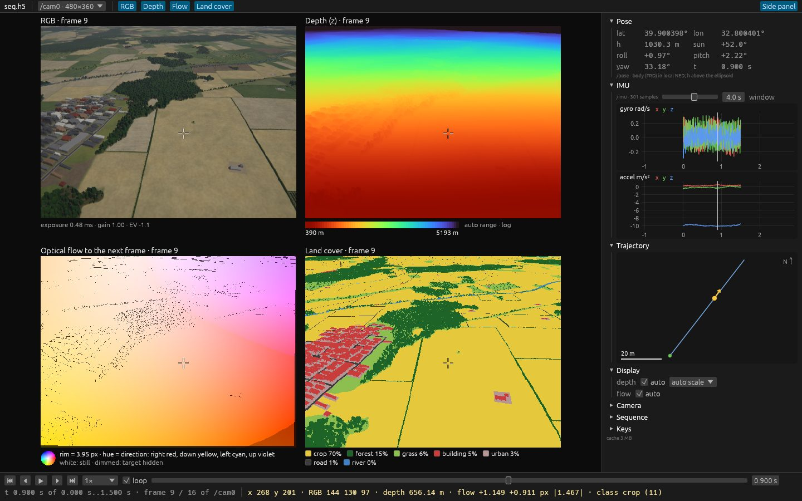
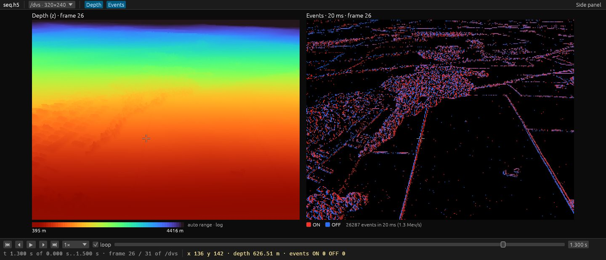

# Looking at a dataset (`terrain show`, `terrain export`)

`terrain run` writes one sequence file (HDF5, [`formats.md`](formats.md)). Two commands look at
it without any Python:

- **`terrain show SEQ.h5`**: an interactive viewer. It shows every modality of a camera on a
  timeline, with the pose, the IMU, the trajectory and the file's metadata next to it.
- **`terrain export SEQ.h5`**: PNG sequences or videos of the modalities, for papers, slides
  and quick checks.

```sh
terrain run -c configs/quick.yaml
terrain show out/quick/seq.h5                                   # the viewer
terrain show out/quick/seq.h5 --snapshot shot.png --frame 10    # one picture, no window
terrain export out/quick/seq.h5 --out out/quick/frames          # PNGs of every modality
terrain export out/quick/seq.h5 --side-by-side --out quick.mp4  # one labelled video (ffmpeg)
```



<sub>`terrain show seq.h5 --frame 9 --pointer 330,240 --snapshot …`: a camera at 1 km looking 35°
down. Below the timeline, the values of every panel under the pointer.</sub>

## The viewer

- **Top bar:**
  - the camera (multi-camera rigs);
  - the modalities shown: RGB (or gray), depth, optical flow, land cover, events. Several of them
    form a grid.
- **Timeline** (bottom):
  - play / pause, frame steps, first / last, playback speed (0.05× to 30×), loop;
  - a slider over the whole sequence (it snaps to the camera's frames);
  - the time on the sequence clock (s), the frame index of the camera;
  - with the pointer over an image: the value of every panel at that pixel (RGB, depth in m,
    flow in px, the land cover class, ON / OFF event counts and the age of the latest event).
- **Side panel** (toggle *Side panel*):
  - *Pose*: latitude, longitude, height above the ellipsoid, roll / pitch / yaw of the body in
    the local NED frame, the sun's elevation;
  - *IMU*: gyroscope and accelerometer over an adjustable window around the current time;
  - *Trajectory*: the flight from above (north up, in the NED frame of the first pose), the
    position and heading now;
  - *Display*: the settings below;
  - *Camera*: model, resolution, intrinsics, distortion, `T_body_cam`, frame rate, the camera
    YAML and the event simulator settings;
  - *Sequence*: format, `t0`, conventions and the scenario YAML.

| key | |
|---|---|
| **Space** | play / pause |
| **← / →** | previous / next frame (**Shift**: 10 frames); for a camera without frames, one event window |
| **Home / End** | first / last frame |

### What the colours mean

| modality | |
|---|---|
| depth | turbo colour map, near red to far blue / dark; black: sky (+inf). Range: each frame's 2nd–98th percentile (*auto*) or fixed; *auto scale* is logarithmic when the range spans more than a factor 4 (oblique views to the horizon) |
| flow | the Middlebury colour wheel: hue = direction (right red, down yellow, left cyan, up violet), saturation = magnitude, white = still; the wheel's rim at the legend's px (each frame's 99th percentile, or fixed). Dimmed: `flow_valid` = 0 (the target is hidden in the next frame) |
| land cover | the generator's class palette, the classes in view with their share; black: sky (255) |
| events | the events in a window (default 10 ms) ending at the time shown: ON red, OFF blue, mixed pixels in between, brighter with more events. On black, on the camera's gray frame (cameras with RGB), or as a *time surface*: the latest event per pixel fading with its age over the window |
| stars | catalogue stars (`stars` modality) ringed on the image up to a magnitude (default 6.5): yellow on sky pixels, gray behind the terrain |



<sub>The event camera of a rig (`--camera /dvs --window-ms 20 --no-side-panel`): its depth
ground truth next to its events.</sub>

### Files of any kind

The viewer finds the groups by their contents (a camera has `calib/resolution`, the IMU `accel`
and `gyro`, the body poses `lla`), so it does not need the scenario's paths. It shows what a file
has: a camera without frames (events only) steps by event windows, and a file without cameras
(IMU and poses) shows its plots in the main view.

### Large files

The viewer opens a file instantly: it reads only the timestamps, the calibration, the body poses
and the events' millisecond index on opening. Frames, event windows and IMU windows are read on
demand by a background thread into a 512 MB cache; while playing, it reads ahead.

### Options

| option | default | |
|---|---|---|
| `--camera PATH` | the first camera with frames | HDF5 path (`/cam0`) or name (`cam0`) |
| `--frame N` / `--time S` | the first frame | where to start (`--time`: s on the sequence clock) |
| `--modalities rgb,depth,…` | all the camera has | what the grid shows |
| `--window-ms MS` | 10 | event window |
| `--events black\|gray\|surface` | black | how events are drawn |
| `--depth-range NEAR,FAR` | each frame's own | fixed depth colour range (m) |
| `--depth-scale auto\|linear\|log` | auto | depth colour scale |
| `--flow-max PX` | each frame's own | flow magnitude at the wheel's rim |
| `--star-mag M`, `--no-stars` | 6.5 | catalogue stars ringed up to magnitude M |
| `--no-side-panel` | | start without the side panel |

### Snapshots

`--snapshot out.png` renders the viewer once, without a window, and exits: for documentation,
CI and remote machines. It runs on the CPU (a small software renderer of the viewer's own
drawing), so it needs neither a GPU nor a display. `--size WxH` (points, default 1600x1000),
`--scale 2` (pixels per point: a sharper picture twice the size), `--pointer x,y` (the pointer
there: crosshairs and the pixel readout), `--no-side-panel`. The pictures above are snapshots.

The window itself needs a GPU (wgpu, like `terrain view`).

## Export

```sh
terrain export SEQ.h5 [--camera /cam0] [-m rgb,depth,flow,landcover,events] --out DIR|FILE.mp4
```

- **PNGs** (`--out DIR`): `DIR/<modality>/NNNNNN.png` at the camera's resolution (`NNNNNN` is the
  frame index; for a camera without frames, the picture's index), and `DIR/frames.csv` (index,
  frame, t in µs).
- **Video** (`--out FILE.mp4`, `.mkv`, `.mov` or `.webm`): ffmpeg encodes raw frames piped
  to it (H.264, or VP9 for `.webm`; `--crf`, default 18). Several modalities without
  `--side-by-side` give one video each, `FILE_<modality>.mp4`. Without ffmpeg on the PATH it
  stops with a hint (install it, or export PNGs).
- **`--side-by-side`**: all modalities in one picture per frame, each with its title and legend
  (as in the viewer): `DIR/grid/NNNNNN.png` or one video.
- **Colours:** those of the viewer, with ranges fixed for the whole export so that colours stay
  put: the depth range and the flow scale come from up to 8 frames spread over it, unless
  `--depth-range` / `--flow-max` give them. The display options of `terrain show` apply
  (`--window-ms`, `--events`, `--depth-scale`, `--star-mag`, `--no-stars`).
- **Which frames:** `--start` / `--end` (s on the sequence clock), `--every N`. A camera without
  frames (events only) gives pictures at `--rate` (default 30 Hz), the first one a window in.
- **Frame rate:** `--fps` (default: the camera's, i.e. real time).

```sh
terrain export seq.h5 --camera /dvs -m events --window-ms 5 --events surface --out dvs.mp4
terrain export seq.h5 -m rgb,depth --start 2 --end 4 --out clip            # clip/rgb, clip/depth
terrain export seq.h5 --side-by-side --every 5 --fps 10 --out overview.mp4
```

For analysis, read the file directly (h5py reads it as is; layout in [`formats.md`](formats.md)).
